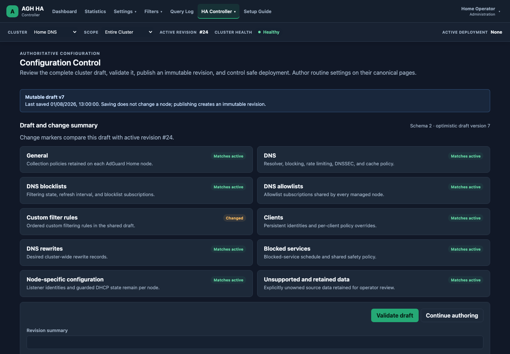
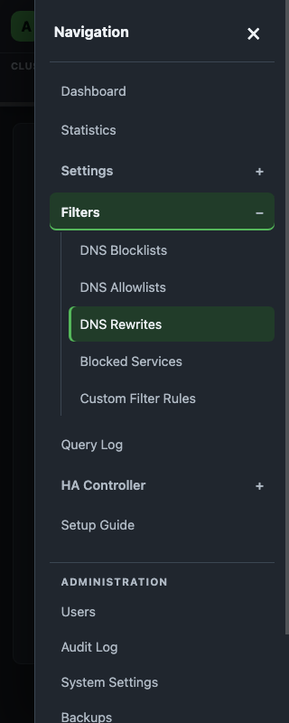

# AGH HA Controller

AGH HA Controller is a management plane for running two or more AdGuard Home instances as a coordinated, highly available DNS service.

AdGuard Home remains the DNS engine. AGH HA Controller currently provides the shared control plane for configuration, authentication, revision history, deployment, drift detection, controller-collected cluster statistics, and a centrally retained, node-attributed Query Log.

## Why this project exists

Running two AdGuard Home servers gives DNS redundancy, but it does not create a true HA management experience. Each node still has its own configuration, statistics, query logs, users, and operational state.

AGH HA Controller is intended to solve that gap by providing:

- One login and one management interface.
- A single authoritative desired configuration.
- Safe deployment of changes to every node.
- Automatic detection and correction of configuration drift.
- Revision history, comparison, rollback, and audit logging.
- Cluster-wide health, statistics, and query logs.
- Node-level attribution for troubleshooting and capacity analysis.
- A failure model where DNS continues working even when the controller is offline.

## Project status

Release 0.7 adds authenticated Operational Status for API/PostgreSQL, node
connectivity versus full observation, per-node Statistics and Query Log
collection, known gaps, workers, retention, and storage growth. The Dashboard
links a compact summary, cleanup is bounded, and opt-in bearer-protected
Prometheus worker metrics are available. Releases 0.5 Statistics and 0.6 Query
Log are complete and validated. AdGuard Home remains the only DNS engine; the
controller can stop without interrupting DNS. See the [operational-health
design](docs/backend/operational-health.md), [feature
ledger](docs/product/feature-ledger.md), and [ADR-0029](docs/decisions/ADR-0029-remain-agentless-by-default.md).

The first meaningful product milestone is the configuration-control MVP:

1. Register two or more AdGuard Home nodes.
2. Import an existing node configuration.
3. Store an authoritative desired state.
4. Compare desired state with each node.
5. Deploy a new revision.
6. Verify convergence.
7. Detect and correct direct changes made on a node.
8. Roll back to a previous revision.

See [docs/roadmap/roadmap.md](docs/roadmap/roadmap.md) for the full release plan.

## Reference deployment

The initial reference deployment assumes:

- Two Debian 13 LXCs running AdGuard Home.
- One Debian 13 LXC running AGH HA Controller.
- PostgreSQL on the controller host or a separate database host.
- Node communication over HTTPS using the AdGuard Home REST API.
- systemd-managed controller services.
- No node-side Atlas agent; supported integrations use AdGuard Home APIs.

## Architecture principles

- **Controller is not in the DNS path.**
- **AdGuard Home remains independently functional.**
- **Desired state lives in the controller.**
- **Applied state lives on each node.**
- **Manual node changes are treated as drift.**
- **Node-specific settings are modelled explicitly.**
- **All deployments are revisioned and auditable.**
- **Backward-compatible, capability-aware node management is required.**
- **Native platform APIs are preferred; local agents require measured need.**

The complete architecture is documented in [docs/architecture/architecture.md](docs/architecture/architecture.md).

## Technology stack

### Services implemented through 0.7

- `agh-ha-controller`: one Go process providing the `/api/v1` REST API, same-origin React UI, authentication, cluster/node management, health/statistics/query-log polling, schema-versioned configuration observation/capabilities, desired drafts, immutable revisions, durable deployment execution, semantic read-back verification, drift evaluation/reconciliation, audited filter refresh, bounded retention, Operational Status, protected metrics, session cleanup, audit access, and operational probes.
- PostgreSQL 17: the system of record for users/sessions, clusters/nodes, encrypted credential envelopes, capability profiles, immutable observations/revisions, optimistic drafts, deployments and ordered per-node tasks, drift events, audit history, normalized node-attributed statistics, query events, and query-ingestion evidence.
- AdGuard Home adapter: bounded direct HTTP(S) reads and version-aware writes. Schema v2 manages broader DNS behavior, blocklists/allowlists, custom rules, persistent clients, rewrites, blocked-service schedules, safety services, Safe Search, query-log/statistics policy, and guarded DHCP configuration/static leases. DNS bind hosts/port remain verification-only. TLS responses are reduced to public status and certificate metadata before entering domain state.
- Deployment worker: claims durable jobs, validates and observes all targets before mutation, applies one node at a time, skips already-converged DHCP configuration writes, stops on first failure, honors cancellation only between nodes, verifies by a new immutable observation, and activates the revision only after total success. Rejected mutations retain a safe method/path/status diagnostic on the per-node task without storing AdGuard Home response bodies.
- Reconciliation worker: periodically compares the active revision's effective configuration with fresh node observations, deduplicates structured drift, and applies Manual, Alert, or Enforce policy while excluding maintenance nodes.

AdGuard Home remains the live DNS service and never sends normal DNS traffic through the controller. Release 0.5 reads bounded aggregate statistics directly from supported nodes. Release 0.6 separately polls bounded query-log pages. ADR-0029 keeps these native API paths standard and makes any forwarder evidence-triggered future work.

### Controller backend

- Go
- PostgreSQL
- REST API
- Background reconciliation workers
- Structured logging
- Prometheus-compatible metrics

### Frontend

- React
- TypeScript
- Vite
- Component-driven feature modules
- Dark mode modelled closely on AdGuard Home
- Responsive desktop-first administration interface

Canonical navigation is grouped under Settings, Filters, and HA Controller.
Statistics and Query Log are complete cluster/node experiences. Query Log
always preserves source-node attribution and presents collection coverage.
Previous Release 0.4 settings URLs remain usable through documented
compatibility redirects.

HA Controller contains five distinct pages:

- **Nodes** — managed infrastructure, health, compatibility, observation, and convergence.
- **Configuration Control** — forward-looking draft review, validation, publication, and advanced adoption.
- **Revisions** — immutable revisions, semantic comparison, deployment preview, and deployment-based rollback.
- **Deployments** — active and historical execution with ordered per-node verification results.
- **Drift** — current desired-versus-observed convergence incidents and resolution.

### Release 0.4.1 interface

[](docs/frontend/screenshots/release-0.4.1/configuration-control-desktop.png)

[](docs/frontend/screenshots/release-0.4.1/phase-10-mobile-drawer-dark-320.png)

### Operational health

Administration -> Operational Status answers whether Atlas itself is healthy.
`/health` is liveness, `/ready` is PostgreSQL-aware readiness, and the detailed
cluster endpoint is authenticated. Set a random `METRICS_BEARER_TOKEN` of at
least 32 characters to enable `/metrics`; it otherwise returns 404. Restrict
enabled metrics with host/reverse-proxy policy and use the token as the
Prometheus bearer credential.

Central Query Log retention is configured by `QUERY_LOG_RETENTION` (1 hour to
90 days) and remains distinct from node-local policy. Statistics retains 32
days of snapshots/hourly buckets and 400 days of daily rollups. The status page
shows approximate PostgreSQL storage and retained time bounds; see the
[runbook](docs/operations/runbook.md) for troubleshooting and maintenance.

## Repository layout

```text
cmd/                  Executable entry points
internal/             Controller domain and infrastructure packages
web/                  React frontend
migrations/           PostgreSQL database migrations
packaging/            systemd and Docker packaging
scripts/              Development and release scripts
tests/                Integration and end-to-end tests
examples/             Example configuration
docs/                 Product, architecture, design, and operations docs
```

## Install with Docker Compose

On an LXC or host with Git, Docker Engine, and Docker Compose v2:

```bash
git clone https://github.com/benchristian88/agh-ha-controller.git
cd agh-ha-controller
cp .env.example .env
openssl rand -hex 24
openssl rand -base64 48
openssl rand -base64 32
```

Put those three generated values into `POSTGRES_PASSWORD`, `SESSION_SECRET`, and `CREDENTIAL_ENCRYPTION_KEY` in `.env`. Set `PUBLIC_BASE_URL` to the URL browsers use, then run:

```bash
docker compose up --build --detach
docker compose ps
```

The stack builds the Go controller and React UI from the checkout, runs PostgreSQL 17 with a persistent named volume, applies embedded migrations, and exposes port 8080 by default. Use `docker compose logs -f controller` for startup diagnostics. Back up the PostgreSQL volume and `.env`; losing `CREDENTIAL_ENCRYPTION_KEY` makes stored node credentials unrecoverable.

## Install directly with systemd

The reference path is Debian 13, including an unprivileged Debian LXC. Install PostgreSQL, Go 1.24, Node.js 22/npm, Git, Make, and OpenSSL, clone the repository, then run:

```bash
cd agh-ha-controller
sudo PUBLIC_BASE_URL=https://controller.example.test ./scripts/install-systemd.sh
```

The installer builds from source without requiring ripgrep, creates the `aghha` service account and PostgreSQL database, generates protected secrets, installs the binary/UI, enables the hardened service, and preserves `/etc/agh-ha-controller/agh-ha-controller.env` on reruns. Inspect it with `systemctl status agh-ha-controller` and `journalctl -u agh-ha-controller -f`.

## Combined Query Log

Open `/query-log` and use the global scope selector for the entire cluster or a
single node. Every row retains its source node. Domain/client search and status,
query-type, client, and node filters execute on the controller; older results
use bounded cursor pagination. Coverage distinguishes current, stale,
unsupported, maintenance, node-logging-disabled, failed, and known-gap nodes.

Central collection defaults to every 30 seconds and central retention to seven
days. Configure these with `QUERY_LOG_COLLECTION_ENABLED`,
`QUERY_LOG_POLL_INTERVAL`, and `QUERY_LOG_RETENTION`; they do not change the
node-local query-log enablement, anonymisation, ignore, or retention policy in
the schema-v2 General Settings draft. Atlas preserves anonymised client data as
received and excludes raw events from routine logs and support bundles.

Query detail can propose an allow/block custom rule, prefill a DNS rewrite, or
search managed clients. These links enter existing mutable desired-state
workflows. Operators must still add and save the draft, publish an immutable
revision, and explicitly deploy it.

## Authoritative configuration workflow

After adding nodes, use the grouped `/settings/*` and `/filters/*` pages for routine AdGuard Home settings and save the shared draft with optimistic concurrency. Open `/ha/configuration` to review the structured draft change summary, validate every target, and publish an immutable revision. Publication remains on Configuration Control and links to the exact API-returned revision at `/ha/revisions?revisionId=<id>`; it never deploys automatically. Review the revision inline, load its deployment preview, and explicitly confirm deployment. Execution opens at `/ha/deployments?deploymentId=<id>` with ordered per-node phases, safe errors, and read-back verification. Continuing desired-versus-observed divergence is managed separately under `/ha/drift`, where incidents expand inline and restore opens the exact created deployment. `/ha/history` remains a query-and-fragment-preserving compatibility redirect.

Listener addresses and DNS port are read from AdGuard Home's `/control/status` response and retained as verification-only node overrides. If a draft created by the initial 0.3.0 build reports an empty/invalid listener override, refresh and re-import the named node; repeat for each enabled node that is missing an override. Import replaces the draft's shared values with the selected snapshot, so review and reapply intended shared edits after the final recovery import.

The initial strategy is intentionally sequential and stop-on-failure. Every target is revalidated before the first write. Each changed node is read back and compared semantically. A revision becomes active only after every target succeeds. Cancellation is safe-boundary only, and a controller restart records an interrupted outcome rather than assuming success.

Direct changes against managed values become durable drift events after an active revision exists. Manual leaves the choice to the operator, Alert records a visible alert without mutation, and Enforce creates a targeted verified deployment. Restore desired state, adopt the observation into the draft, or place the node in maintenance from **Drift**. Adoption still requires Configuration Control validation and a new published revision; Revisions rollback deploys a historical revision without editing it.

Canonical schema v2 covers the Release 0.4 managed surface. AdGuard Home v0.107.53 through the current stable v0.107.78 contract can import and publish schema v2. v0.107.52 remains supported on frozen schema v1 so historical observations, revisions, rollback, and reconciliation continue to work; newer unverified contracts are reported as unknown rather than assumed safe. Existing schema-v1 records are never rewritten. Capability preflight blocks deployment when any required feature was not successfully observed.

TLS is inventory-only: certificate chains, private keys, and filesystem paths are discarded at the adapter boundary. DHCP configuration and static leases are node-specific; validation permits at most one enabled DHCP node, and role handoff deploys desired-disabled nodes before the desired-active node. Filter refresh is an explicit audited per-node operation, with fleet partial results shown by the UI.

After either installation, open `PUBLIC_BASE_URL`. When the database has no users, the application shows “Create your administrator.” That transaction creates the only initial administrator and signs it in; setup returns HTTP 409 after any user exists. Then create a cluster and add each AdGuard Home node.

Upgrade a git installation by backing up PostgreSQL and runtime secrets, pulling the desired tag, and rerunning `docker compose up --build --detach` or `scripts/install-systemd.sh`. Embedded append-only migrations run at startup. Release 0.2.2 and later systemd upgrades explicitly restart and verify the service after installing the binary and UI, preventing mixed frontend/API versions.

Development and test commands are documented in [local development](docs/development/local-development.md).

## Initial development order

1. Repository tooling and CI.
2. Database migrations.
3. Local authentication.
4. Node registration and encrypted credential storage.
5. AdGuard Home client library.
6. Health polling.
7. Configuration inventory.
8. Canonical configuration model.
9. Revision and deployment engine.
10. Reconciliation and drift correction.

## Licensing

No final licence has been selected yet.

Do not add a licence file or copy third-party code until the project owner confirms the intended licensing model. The intended commercial posture is:

- Free use for personal and homelab environments.
- Open contribution model.
- Protection against third parties repackaging and selling the project as their own product.
- A future supported commercial edition for MSP and business use.

That intent may require a source-available licence rather than an OSI-approved open-source licence. Legal advice should be obtained before release.

## Documentation index

- [Architecture](docs/architecture/architecture.md)
- [Configuration model](docs/architecture/configuration-model.md)
- [Reconciliation engine](docs/architecture/reconciliation-engine.md)
- [Deployment architecture](docs/architecture/deployment.md)
- [Roadmap](docs/roadmap/roadmap.md)
- [Release plan](docs/roadmap/release-plan.md)
- [Frontend design](docs/frontend/frontend-design.md)
- [Database design](docs/database/database-design.md)
- [API design](docs/api/controller-api.md)
- [Security model](docs/security/security.md)
- [Local development](docs/development/local-development.md)
- [Testing strategy](docs/development/testing.md)
- [Operational runbook](docs/operations/runbook.md)
