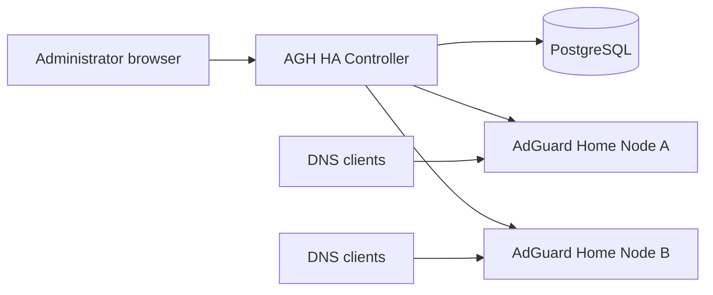
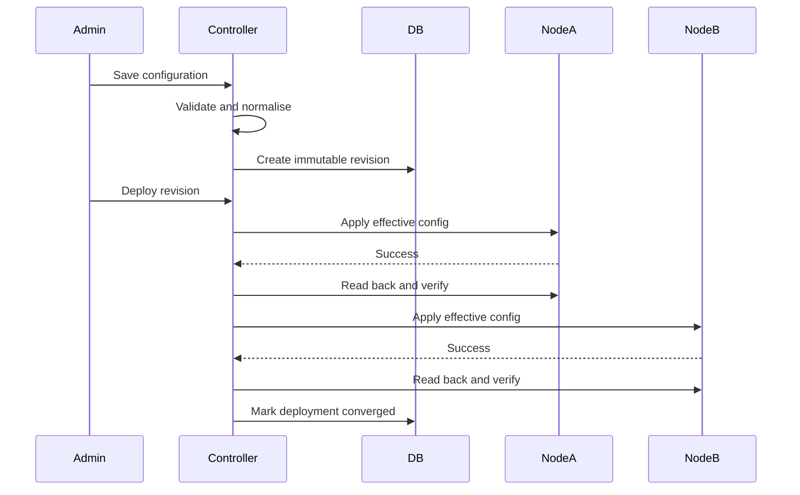

# Application Architecture

## 1. Purpose

AGH HA Controller coordinates multiple AdGuard Home instances as a single operational cluster.

It does not replace AdGuard Home and it does not serve DNS. It provides the management and observability layer that AdGuard Home does not natively provide across nodes.

## 2. System context

DNS clients communicate directly with AdGuard Home nodes. The controller is never required to answer a DNS request.

## 3. Core components

### Implemented release architecture

The implemented foundation is one Go process containing the API, static frontend server, immediate/interval health poller, and expired-session cleanup. It uses PostgreSQL for users, sessions, clusters, nodes, health results, and audit events. The React build is installed as a directory and served by the Go process on the API origin.

In 0.1 the process only called AdGuard Home's read-only `/control/status` endpoint. It has never contained a DNS listener or proxy. Configuration, reconciliation, Statistics, and Query Log API ingestion arrived in later releases; ADR-0029 keeps node-local agents out of the standard architecture.

Release 0.1.1 packages this same process through two git-based paths: the reference Debian/systemd installer and a production Docker Compose stack with PostgreSQL. Packaging does not change the process, database, same-origin frontend, or DNS-independence boundaries.

Release 0.2 adds a read-only configuration-inventory service inside the same process. It reads supported AdGuard Home administration endpoints, translates raw payloads into canonical schema v1, stores immutable observation attempts and current capability profiles, and provides semantic comparison and an explicitly confirmed non-authoritative draft import. It does not add a node writer, deployment engine, active revision, drift enforcement, or DNS path.

Release 0.3 keeps the same combined process and adds `internal/controlplane`, durable PostgreSQL revisions/deployments/per-node tasks/drift events, a sequential deployment executor, and a periodic drift evaluator. Desired documents are distinct from observed documents. All targets are capability/listener validated and freshly observed before the first supported HTTP API write; each node is read back before the next begins. Complete success selects the active revision. Manual, Alert, and Enforce reconciliation and maintenance state do not change the DNS-independence boundary. ADR-0024 defines failure, cancellation, restart, rollback, and unsupported-listener behavior.

Release 0.4 adds schema-v2 fields through the existing configuration, inventory, control-plane, and adapter boundaries rather than a parallel settings store. Shared desired state now covers broader DNS, filter/allowlist, client, rewrite, service/safety, query-log, and statistics policy. DHCP configuration/static leases remain node overrides; dynamic leases and redacted TLS status remain observations. Schema v1 is immutable and is projected from current observations for historical rollback and reconciliation. v0.107.52 remains on schema v1; schema v2 supports the explicitly version-gated v0.107.53–v0.107.78 contract. Audited filter refresh is an explicit operation outside revision deployment. ADR-0025 defines compatibility, TLS redaction, managed-field comparison, and DHCP handoff behavior.

Release 0.5 adds `internal/telemetry` and a bounded statistics worker to the
same controller process. The adapter reads exact recent windows directly from
explicitly supported nodes; PostgreSQL stores normalized immutable snapshots,
small poll evidence, and overlap-safe node buckets. Aggregation happens in the
service/API layer with explicit coverage and weighted metrics. The worker has
no DNS listener, no node mutation, and no query-log dependency. Controller
downtime pauses collection while every node continues serving DNS. ADR-0028
defines its compatibility, mathematics, retention, and failure boundaries.

Release 0.6 adds `internal/querylog` plus a bounded independent polling worker.
The version-aware adapter follows each node's `oldest`/`older_than` source
cursor, PostgreSQL stores normalized node/cluster-attributed events separately
from desired/observed configuration, and the API performs parameterized search
and keyset pagination over retained data. Durable per-node checkpoints and
attempts drive honest freshness/gap coverage after restart or failure. The
browser never calls a node, and contextual rule/rewrite actions enter existing
mutable draft workflows without publication or deployment. ADR-0015 and
`docs/backend/query-ingestion.md` define identity, privacy, retention, and
source-fidelity limitations.

### 3.1 Controller API

Responsibilities:

- Authentication and session management.
- Node onboarding.
- Desired configuration management.
- Revision creation and comparison.
- Deployment orchestration.
- Drift and reconciliation state.
- Statistics and query-log APIs.
- Audit logging.
- UI backend.

### 3.2 Reconciliation engine

Responsibilities:

- Poll observed node configuration.
- Normalise configuration into a canonical model.
- Compare desired and observed states.
- Record drift.
- Apply policy:
  - Enforce.
  - Alert only.
  - Manual adoption.
- Verify convergence after deployment.
- Retry transient failures safely.

### 3.3 AdGuard Home adapter

A version-aware client for the official AdGuard Home REST API.

Responsibilities:

- Authentication.
- Capability discovery.
- Reading configuration.
- Applying supported settings.
- Reading health and version.
- Reading statistics.
- Reading query-log records.
- Translating API payloads into controller domain types.
- Mapping errors into stable controller error categories.

The rest of the application must not depend directly on raw AdGuard Home API payloads.

### 3.4 PostgreSQL

PostgreSQL stores:

- Users and sessions.
- Clusters and nodes.
- Encrypted node credentials.
- Draft configurations.
- Immutable revisions.
- Deployment and per-node deployment results.
- Observed snapshots.
- Drift events.
- Statistics snapshots.
- Query events during the polling phase.
- Query-ingestion checkpoints and attempts.
- Audit records.

### 3.5 Frontend

The frontend provides an AdGuard Home-inspired dark interface with added HA concepts.

Primary navigation follows ADR-0026. HA Controller has five distinct task
surfaces: Nodes for infrastructure, Configuration Control for forward-looking
draft approval/publication, Deployments for execution events, Drift for current
convergence, and Change History for immutable revisions/comparison/rollback.
Routine authoring remains under the grouped Settings and Filters routes.

### 3.6 Agentless integration boundary

Release 0.7 adopts ADR-0029: native platform APIs are the standard Statistics
and Query Log integration. A local forwarder is conditional, unassigned work
that requires measured evidence that API polling cannot meet reliability,
latency, scale, load, or compatibility needs.

## 4. Source-of-truth model

The controller stores four separate forms of state.

### Desired state

The configuration operators intend the cluster to run.

### Effective state

The result of merging shared configuration with node-specific overrides.

### Observed state

The normalised configuration read from a node.

### Applied state

The exact revision and effective configuration last successfully deployed to a node.

These concepts must remain distinct.

## 5. Configuration deployment flow

The initial strategy is sequential deployment to reduce blast radius. Parallel deployment may be added later as an explicit option.

## 6. Drift detection flow

1. Poll node state.
2. Convert raw API output into the canonical model.
3. Remove non-semantic or volatile fields.
4. Apply stable ordering.
5. Calculate canonical hash.
6. Compare with the effective desired state.
7. Record drift if different.
8. Apply cluster policy.
9. Re-read and verify after correction.

## 7. Availability model

### Controller unavailable

- DNS remains operational.
- Existing AdGuard Home configuration remains active.
- Configuration changes cannot be deployed.
- Statistics ingestion pauses.
- API collectors resume from durable PostgreSQL evidence when the controller returns.

### One AdGuard Home node unavailable

- Other nodes continue serving DNS if clients or the network use both resolvers.
- Controller reports degraded cluster health.
- Deployments may pause or continue based on policy.
- The unavailable node reconciles when it returns.

### Database unavailable

- Controller becomes read-limited or unavailable.
- No configuration deployment is attempted.
- DNS remains operational.

## 8. Node capabilities

AdGuard Home versions may expose different APIs and settings.

Each node record should maintain:

- Product version.
- API compatibility result.
- Capability flags.
- Last successful capability discovery time.
- Unsupported managed fields.
- Upgrade recommendation.

A deployment must fail validation before mutation when a target node cannot support the requested effective configuration.

Release 0.1 stores a status-contract compatibility value (`supported`, `unsupported`, or `unknown`) and the observed product version. Detailed capability documents and unsupported managed fields start in Release 0.2.

## 9. Background jobs

Initial jobs:

- Node health polling.
- Capability refresh.
- Configuration observation.
- Drift reconciliation.
- Statistics collection.
- Query-log polling.
- Retention and aggregation.
- Deployment execution.
- Session cleanup.

Jobs should use persisted state where loss of progress matters.

Implemented in Release 0.1:

- Health polling runs immediately at startup and on a configured interval, with at most four simultaneous node probes.
- Each probe has an explicit timeout and durably updates the node's latest safe status fields.
- Expired and long-revoked sessions are cleaned hourly.

These tasks are idempotent and do not need a durable job queue. Deployment and reconciliation jobs will require persisted progress in later releases.

## 10. Observability

The controller should expose:

- Structured logs.
- Request IDs.
- Deployment IDs.
- Job execution metrics.
- Node polling latency.
- Reconciliation success and failure counts.
- Query ingestion lag.
- Database health.
- HTTP health and readiness endpoints.

Release 0.7 implements a coherent operational-health service in the combined
process. It derives per-node connectivity, observation, Statistics, and Query
Log state from existing durable records; tracks bounded process-worker state;
and reads PostgreSQL relation metadata for storage estimates. Overall health
fails for PostgreSQL loss, degrades for stale/failed integrations, and does not
turn an optional collector issue into process liveness failure. Detailed status
is authenticated. `/health`, `/ready`, and bearer-protected opt-in `/metrics`
retain separate security and availability semantics.

## 11. Scaling approach

The first target is a homelab cluster with two to five nodes.

Use PostgreSQL for all data initially. Introduce partitioning and rollups before considering another database.

ClickHouse is a future option only if real query-event volume makes PostgreSQL operationally unsuitable.

## 12. Architectural boundaries

The following are explicitly out of scope for the initial releases:

- Acting as a DNS proxy.
- Implementing a new DNS server.
- Active-active DHCP.
- Automatic network load balancing.
- Controller high availability.
- Multi-tenant MSP administration.
- Kubernetes-first deployment.
