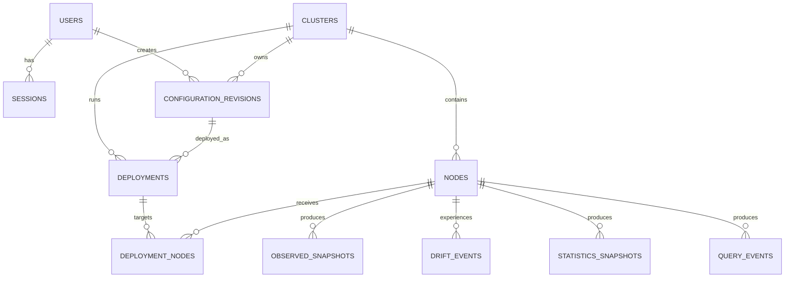

# Database ERD

```mermaid
erDiagram
    USERS ||--o{ SESSIONS : has
    USERS ||--o{ CONFIGURATION_REVISIONS : creates
    CLUSTERS ||--o{ NODES : contains
    CLUSTERS ||--o{ CONFIGURATION_REVISIONS : owns
    CLUSTERS ||--o{ DEPLOYMENTS : runs
    CONFIGURATION_REVISIONS ||--o{ DEPLOYMENTS : deployed_as
    DEPLOYMENTS ||--o{ DEPLOYMENT_NODES : targets
    NODES ||--o{ DEPLOYMENT_NODES : receives
    NODES ||--o{ OBSERVED_SNAPSHOTS : produces
    NODES ||--o{ DRIFT_EVENTS : experiences
    NODES ||--o{ STATISTICS_SNAPSHOTS : produces
    NODES ||--o{ QUERY_EVENTS : produces
```
