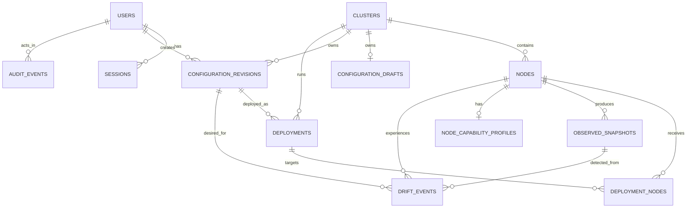

# Database ERD — implemented through Release 0.4

Statistics and query-event tables remain planned for Releases 0.5 and 0.6 and are intentionally absent from this implemented ERD.

Release 0.4 adds no entities or relationships. Migration `000004_release_0_4` permits immutable configuration schema versions 1 and 2 in the existing draft, revision, snapshot, and capability-profile records; it does not rewrite historical payloads.
