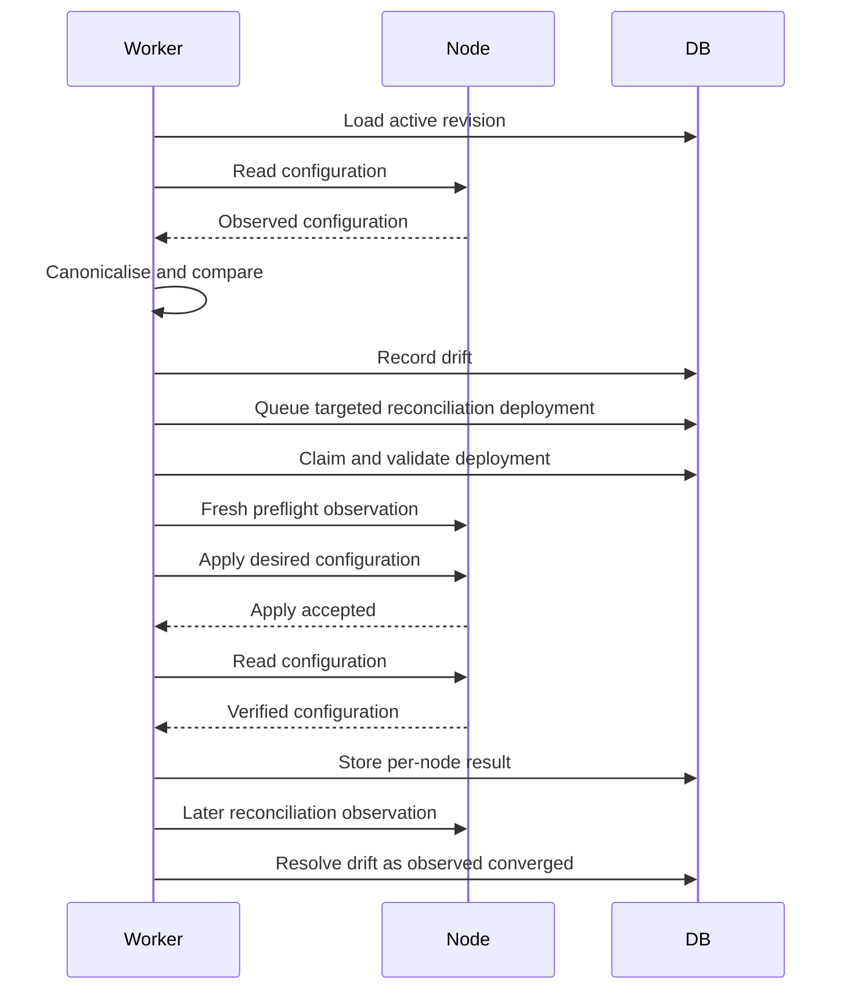

# Sequence Diagrams

## Drift correction

```mermaid
sequenceDiagram
    participant Worker
    participant Node
    participant DB

    Worker->>DB: Load active revision
    Worker->>Node: Read configuration
    Node-->>Worker: Observed configuration
    Worker->>Worker: Canonicalise and compare
    Worker->>DB: Record drift
	Worker->>DB: Queue targeted reconciliation deployment
	Worker->>DB: Claim and validate deployment
	Worker->>Node: Fresh preflight observation
	Worker->>Node: Apply desired configuration
	Node-->>Worker: Apply accepted
	Worker->>Node: Read configuration
	Node-->>Worker: Verified configuration
	Worker->>DB: Store per-node result
	Worker->>Node: Later reconciliation observation
	Worker->>DB: Resolve drift as observed converged
```
