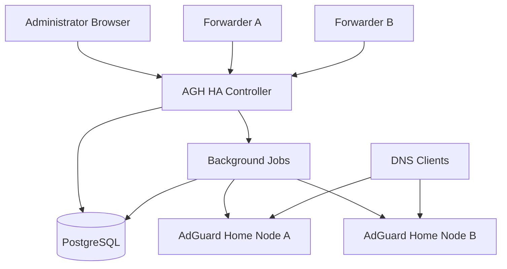

# System Overview Diagram

```mermaid
flowchart TB
    Browser[Administrator Browser]
    Controller[AGH HA Controller]
    Worker[Background Jobs]
    Postgres[(PostgreSQL)]
    NodeA[AdGuard Home Node A]
    NodeB[AdGuard Home Node B]
    ForwarderA[Forwarder A]
    ForwarderB[Forwarder B]
    Clients[DNS Clients]

    Browser --> Controller
    Controller --> Postgres
    Controller --> Worker
    Worker --> Postgres
    Worker --> NodeA
    Worker --> NodeB
    ForwarderA --> Controller
    ForwarderB --> Controller
    Clients --> NodeA
    Clients --> NodeB
```
