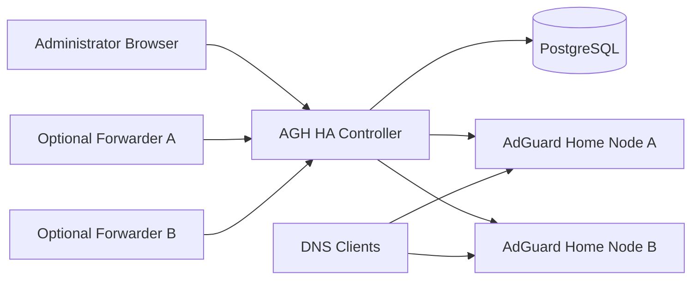
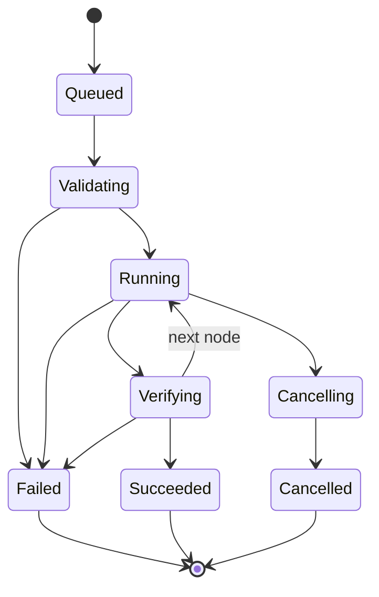
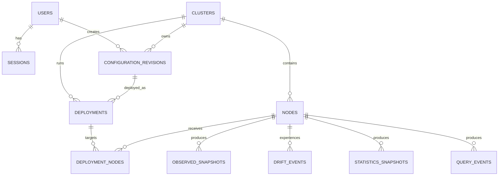
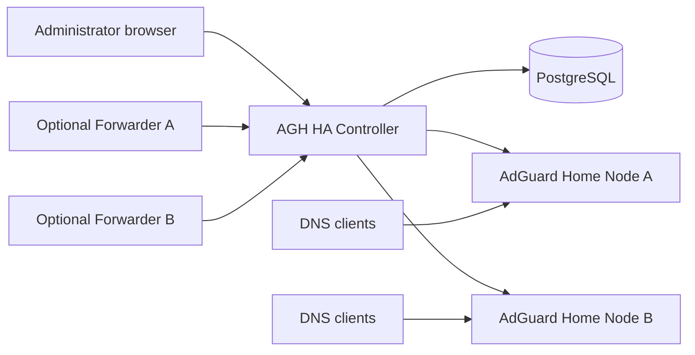
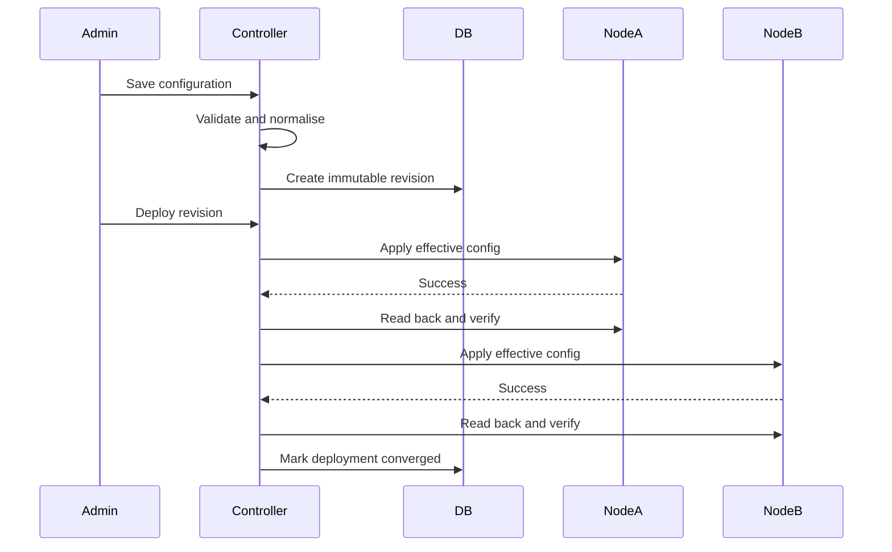

# AGH HA Controller

# Product Design Document

**Document version:** 0.7.0

**Product stage:** Release 0.7 implementation; final external validation pending

**Status:** Living source of truth

**Last updated:** 9 August 2026
**Intended audience:** Product owner, maintainers, contributors, AI coding agents, security reviewers, and future commercial partners

---

## Document purpose

This Product Design Document defines the agreed product direction, operating model, architecture, feature scope, implementation approach, release roadmap, and key constraints for AGH HA Controller.

It is intentionally broader than a conventional software specification. It combines product intent, system design, operating assumptions, user experience, delivery sequencing, and architectural rationale so that future implementation decisions can be tested against a stable source of truth.

This document is authoritative for product intent. More specialised documents under `docs/` remain authoritative for detailed implementation contracts when they are more specific. Architecture Decision Records under `docs/decisions/` explain why major choices were made.

Release 0.1 implementation details and validation status are recorded in `docs/product/feature-ledger.md` and the Release 0.1 reconciliation section of `docs/roadmap/roadmap.md`. ADR-0021 resolves the runtime and security choices that were open in the original baseline.

**Release 0.7 roadmap amendment:** Releases 0.5 Statistics and 0.6 Query Log
are complete and validated. ADR-0029 makes Atlas agentless by default and
supersedes every older fixed-release forwarder reference in this accumulated
design document. Release 0.7 is Operational Hardening & Observability; 0.8 is
HA Operations & Lifecycle; 0.9 is Product and Release Hardening; 1.0 is the
Stable Supported Release. A local Query Log forwarder has no release assignment
and is investigated only after measured API-ingestion failure. The current
canonical roadmap is `docs/roadmap/roadmap.md`; historical forwarder sections
below are retained as superseded design history, not active scope.

Release 0.1.1 adds git-based Debian/systemd and Docker Compose installation while preserving the systemd reference topology and the same controller/database boundaries. ADR-0022 records the decision to bring supported Docker installation forward.

Release 0.2 freezes canonical configuration schema v1 as a read-only DNS/filtering inventory. ADR-0023 resolves the historical import ambiguity: confirmed import creates an optimistic non-authoritative draft only; immutable publication and convergence remain Release 0.3.

Release 0.3 implements that authoritative boundary with a distinct desired document, immutable numbered revisions, durable sequential per-node deployments, semantic read-back verification, deployment-based rollback, deduplicated drift, Manual/Alert/Enforce reconciliation, and maintenance mode. ADR-0024 records the supported-writer and failure semantics; actual implementation/validation status is maintained in the feature ledger and roadmap reconciliation rather than rewriting this historical product baseline.

### Decision labels used in this document

- **Agreed:** The direction has been explicitly selected and should be treated as a project constraint unless changed through an ADR.
- **Proposed:** The approach is the preferred starting point but may change through implementation discovery.
- **Deferred:** The capability is intentionally excluded from the current delivery sequence.
- **Open:** A decision is still required before the affected capability is released.

---

# Part I — Executive Direction

## 1. Executive summary

AGH HA Controller is an independent management plane for operating two or more AdGuard Home instances as one coherent, highly available DNS service.

AdGuard Home already provides a strong single-node DNS filtering product. Operators can run multiple instances for DNS resilience, but the instances remain operationally separate: configuration is duplicated, statistics are fragmented, query logs are isolated, users and sessions are separate, and direct changes can cause the nodes to diverge. The result is DNS redundancy without a true HA management experience.

AGH HA Controller closes that gap.

The controller will provide:

- one login and administration interface;
- one authoritative desired configuration;
- shared configuration with explicit node-specific overrides;
- immutable revisions and structured comparison;
- safe deployment, verification, and rollback;
- continuous drift detection and reconciliation;
- cluster and node health views;
- aggregated statistics;
- a combined query log;
- optional node-side forwarding for reliable high-volume query ingestion;
- a durable audit trail;
- an installation path suitable for homelab users first and MSP or commercial operation later.

The controller will **not** replace AdGuard Home, fork its codebase, proxy normal DNS traffic, or become a dependency for live DNS resolution. If the controller or its database is unavailable, AdGuard Home nodes continue serving DNS using their last applied configuration.

The central product promise is:

> Make running multiple AdGuard Home instances feel like running one highly available product.

## 2. Product thesis

The project is based on five observations.

1. **Redundant DNS nodes are common, but operationally awkward.** Homelab operators frequently run two resolvers because DNS is foundational. They then manually repeat changes or use synchronisation scripts that lack durable desired state, verification, and rollback.
2. **Configuration copying is not configuration management.** A reliable HA control plane must know the intended state, the state observed on each node, and whether a deployment was verified.
3. **The controller must fail safely.** DNS availability is more important than management-plane availability. Therefore, the controller cannot sit in the data path.
4. **The core differentiator is desired-state control.** Aggregated dashboards are useful, but configuration revisioning, deployment, and drift reconciliation create the durable product value.
5. **A simple homelab product can become a broader infrastructure product.** The same control-plane concepts can later support multiple clusters, sites, roles, OIDC, remote collectors, and an MSP edition without compromising the initial experience.

## 3. Value proposition

### For homelab operators

AGH HA Controller removes repetitive administration and uncertainty. An operator can add two nodes, import the current configuration, make a change once, deploy it safely, and see whether every node converged.

### For advanced self-hosters

The product provides revision history, node attribution, structured drift, health, audit records, central query history, and a platform that can be integrated with existing identity, monitoring, backup, and reverse-proxy systems.

### For future MSP or business users

The architecture creates a path to centrally govern multiple DNS clusters with stronger access control, audit, support, reporting, site boundaries, and operational workflows.

## 4. Product positioning

AGH HA Controller is positioned as a **control plane for AdGuard Home**, not as a competing DNS implementation.

It sits conceptually between:

- manual administration of multiple independent AdGuard Home nodes;
- lightweight file or API synchronisation scripts;
- general infrastructure automation tools that require the operator to build the product experience themselves; and
- commercial DNS management platforms that do not preserve the self-hosted AdGuard Home operating model.

Its differentiation is the combination of:

- AdGuard Home-specific understanding;
- desired-state configuration management;
- HA-aware deployment and verification;
- central observability;
- controller-independent DNS operation; and
- an approachable administration interface.

## 5. Product goals

### 5.1 Primary goals

1. Allow an operator to manage multiple AdGuard Home instances from one interface.
2. Establish the controller as the authoritative source of managed configuration.
3. Detect, explain, and resolve configuration differences.
4. Deploy configuration safely and verify semantic convergence.
5. Preserve DNS service during controller, database, or management-network failure.
6. Aggregate cluster health, statistics, and query logs while preserving node attribution.
7. Provide revision history, rollback, and auditability.
8. Be easy to deploy in a Debian LXC and later through Docker and a Proxmox community installer.
9. Support unmodified AdGuard Home nodes through official APIs.
10. Create a clean foundation for future multi-cluster and commercial capabilities.

### 5.2 Secondary goals

- Familiar AdGuard Home-inspired dark user interface.
- Straightforward backup and restoration.
- Low operational overhead.
- Secure local authentication initially and OIDC later.
- Clear compatibility reporting across AdGuard Home versions.
- Useful diagnostics without exposing secrets or raw query history unnecessarily.

## 6. Non-goals

The following are not goals for the initial product:

- Implementing a DNS resolver or filtering engine.
- Proxying or load-balancing ordinary DNS queries.
- Forking or maintaining a modified AdGuard Home distribution.
- Automatically configuring client devices, routers, DHCP servers, VRRP, Anycast, or load balancers.
- Active-active DHCP coordination in early releases.
- Kubernetes-first deployment.
- Controller HA before the single-controller product is stable.
- Multi-tenant MSP operation before the community product is proven.
- Reproducing every AdGuard Home feature in the first release.
- Replacing general monitoring platforms.
- Sending telemetry to an external service by default.

## 7. Product principles

### 7.1 DNS independence

The management plane must never be required for a DNS response. This is the most important architectural boundary.

### 7.2 Desired state over blind synchronisation

The product records operator intent. It does not merely copy the configuration from whichever node changed most recently.

### 7.3 Safe, observable change

Every meaningful change must be validated, revisioned, deployed, verified, and auditable.

### 7.4 Explicit scope

Shared cluster settings and node-specific infrastructure settings must be modelled separately. Hidden exceptions create unsafe automation.

### 7.5 Capability awareness

The controller must understand what each node version can support and prevent incompatible changes before mutation.

### 7.6 Conservative automation

Early deployments should favour sequential, verified changes over speed. Automatic correction must be policy-controlled and visible.

### 7.7 Privacy by default

Central query logs are sensitive. Collection and retention must be transparent, configurable, and disabled or minimal by default until explicitly enabled.

### 7.8 Operational simplicity

The first deployment must work well on a small Debian 13 LXC. Infrastructure should be added only when it solves an evidenced problem.

### 7.9 Documentation-first evolution

Architecture, API, schema, and operator behaviour must remain documented. AI coding agents and human contributors should be able to understand the intended system before changing it.

---

# Part II — Users, Problems, and Workflows

## 8. Primary personas

### 8.1 Homelab operator

A technically capable self-hoster running two AdGuard Home servers for DNS resilience. They may use Proxmox, Debian LXCs, Docker, UniFi, Home Assistant, Nginx Proxy Manager, Cloudflare, or Authentik.

**Needs:**

- install without building a custom platform;
- manage both nodes once;
- know whether nodes match;
- recover from a bad change;
- preserve DNS if the controller fails;
- understand which node answered queries;
- avoid cloud dependency.

**Risks and frustrations:**

- forgetting to update the second node;
- scripts overwriting the wrong source;
- inconsistent clients or rewrites;
- fragmented logs;
- node upgrades changing APIs or defaults;
- breaking DNS while trying to improve HA.

### 8.2 Advanced infrastructure enthusiast

An operator with several sites, VLANs, internal services, monitoring, SSO, and automation. They value APIs, audit history, metrics, and extensibility.

**Needs:**

- external authentication;
- clean APIs;
- Prometheus metrics;
- node and cluster scopes;
- strong diagnostics;
- configuration history;
- predictable deployment behaviour.

### 8.3 Future small-business or MSP administrator

An administrator supporting multiple customers or locations. This persona is not the first-release target but influences architecture boundaries.

**Needs:**

- multi-cluster and site separation;
- role-based access;
- tenant isolation;
- fleet health;
- reporting;
- supportability;
- safe remote collectors;
- commercial support and upgrade guarantees.

## 9. Core jobs to be done

1. **When I operate redundant DNS nodes, I want to make a configuration change once so that all nodes remain consistent.**
2. **When a node differs, I want to understand exactly why so that I can restore or deliberately adopt the change.**
3. **When I deploy a change, I want the system to verify it so that a successful API response is not mistaken for convergence.**
4. **When a change causes a problem, I want to restore a previous known configuration quickly.**
5. **When one node is offline, I want to see the degraded state without losing DNS on the healthy node.**
6. **When I troubleshoot DNS, I want one query log that identifies the answering node.**
7. **When the controller is offline, I want DNS to continue without intervention.**
8. **When I upgrade AdGuard Home, I want compatibility risks identified before configuration is changed.**

## 10. Representative user journeys

### 10.1 First installation

1. Operator installs controller on a Debian 13 LXC.
2. Operator opens the controller URL.
3. First-run flow creates the initial local administrator.
4. Controller validates database, encryption key, time, and public URL.
5. Operator creates a cluster.
6. Dashboard shows an empty, guided state.

### 10.2 Add the first node and import configuration

1. Operator enters node name, URL, credentials, and TLS trust policy.
2. Controller tests connectivity and authentication.
3. Controller reads version and capabilities.
4. Controller observes configuration without changing the node.
5. UI shows what can be managed, what is node-specific, and what is unsupported.
6. Operator chooses to import the configuration.
7. Controller creates Draft 1, then immutable Revision 1 after confirmation.
8. First node is recorded as converged with Revision 1.

### 10.3 Add a second node

1. Operator registers Node B.
2. Controller observes Node B.
3. UI compares Node B with active desired state.
4. Differences are grouped by shared, node-specific, unsupported, and ignored fields.
5. Operator defines Node B overrides such as bind address.
6. Operator previews effective configuration.
7. Controller deploys and verifies Revision 1 on Node B.
8. Cluster becomes healthy and converged.

### 10.4 Make and deploy a change

1. Operator edits a shared DNS, client, filter, or rewrite setting.
2. Change is saved to a mutable draft.
3. Controller validates syntax, semantics, compatibility, and affected nodes.
4. Operator publishes a revision with a summary.
5. UI displays structured diff and restart or risk warnings.
6. Operator starts deployment.
7. Controller applies sequentially and verifies each node.
8. Deployment finishes as converged, partially failed, failed, or cancelled.
9. Activity and audit records are created.

### 10.5 Direct node change creates drift

1. An administrator changes a managed setting directly on Node B.
2. Observation job reads the new configuration.
3. Canonical comparison detects drift.
4. UI shows desired and observed values and identifies Node B.
5. Policy determines behaviour:
   - Enforce: restore desired state automatically.
   - Alert: leave node unchanged and notify.
   - Manual: require restore, adopt, or ignore.
6. Resolution is verified and recorded.

### 10.6 Roll back

1. Operator selects a previous revision.
2. Controller shows differences from the current active revision.
3. Operator creates a rollback deployment.
4. The previous document is not mutated; it is deployed through a new auditable operation.
5. Nodes are verified and active state is updated only under the defined success policy.

### 10.7 Controller outage

1. Controller becomes unavailable.
2. Nodes continue serving DNS.
3. No new configuration is applied.
4. Forwarders, if installed, spool query events locally.
5. When controller returns, health and observations resume.
6. Enforcement should not begin blindly until controller state and time continuity are validated.

---

# Part III — Product Scope and Feature Model

## 11. Capability areas

### 11.1 Cluster and node management

- Create and name clusters.
- Register, edit, disable, maintain, and remove nodes.
- Test connections.
- Record node version and capabilities.
- Show last seen, latency, health, and compatibility.
- Apply labels and optional site metadata.
- Place nodes in maintenance mode.
- Replace a failed node without losing cluster intent.

### 11.2 Authoritative configuration

- Import an initial configuration.
- Edit shared cluster configuration.
- Define node-specific overrides.
- Validate against every target node.
- Save mutable drafts.
- Publish immutable revisions.
- Compare revisions.
- Export and import controller configuration documents.
- Redact secrets from views and exports.

### 11.3 Deployment

- Preview effective configuration by node.
- Identify affected nodes and settings.
- Deploy sequentially initially.
- Record per-node phases and results.
- Re-read and verify applied state.
- Retry safe transient failures.
- Stop or pause after failure according to policy.
- Roll back.
- Preserve a full deployment timeline.

### 11.4 Drift and reconciliation

- Periodically observe node configuration.
- Canonicalise semantically equivalent values.
- Detect structured drift.
- Apply Enforce, Alert, or Manual policy.
- Restore desired state.
- Adopt a direct change into a draft.
- Ignore an unmanaged field.
- Suppress known volatile values.
- Record drift lifecycle and resolution.

### 11.5 AdGuard Home feature coverage

The eventual goal is broad management coverage, including:

- upstream and fallback DNS;
- bootstrap DNS;
- DNS cache and processing settings;
- filter subscriptions and refresh;
- custom filtering rules;
- allow and deny lists;
- persistent clients;
- DNS rewrites;
- blocked services;
- safe browsing;
- parental controls;
- safe search;
- query-log policy;
- statistics policy;
- TLS configuration references;
- selected DHCP inventory and single-active-node controls.

Feature coverage is phased. Unsupported settings must be visible rather than silently ignored.

### 11.6 Health and statistics

- Cluster health summary.
- Node availability, latency, version, and last seen.
- Aggregated DNS queries and blocked queries.
- Node traffic share.
- Average or weighted processing time where mathematically valid.
- Top clients, domains, and blocked domains.
- Cluster versus node scope selector.
- Time-window selection.
- Retention and rollups.

### 11.7 Combined query log

- Search query events across nodes.
- Preserve node identity.
- Filter by time, client, domain, query type, result, and node.
- Show ingestion lag.
- Configurable retention.
- API polling first.
- Optional forwarder later.
- Privacy controls and explicit enablement.

### 11.8 Authentication and users

Initial:

- local administrator accounts;
- secure sessions;
- password change;
- account enable or disable;
- audit of authentication events.

Future:

- OIDC;
- Authentik and Keycloak compatibility;
- role-based access control;
- API tokens;
- cluster-scoped permissions;
- MSP tenant roles.

### 11.9 Audit and activity

Audit records should cover:

- authentication;
- users and roles;
- node onboarding and removal;
- credentials and trust changes;
- drafts and revisions;
- deployments and rollback;
- drift resolution;
- retention changes;
- forwarder registration;
- diagnostic exports;
- security-sensitive settings.

Activity feed is an operator-friendly projection of audit and operational events; it does not replace the durable audit trail.

## 12. Product states and vocabulary

Stable terminology is important because it appears in database values, APIs, logs, UI badges, documentation, and support conversations.

### Cluster health

- Healthy
- Degraded
- Unavailable
- Unknown

### Node health

- Healthy
- Unreachable
- Incompatible
- Maintenance
- Disabled
- Unknown

### Convergence

- Converged
- Drifted
- Pending
- Applying
- Verifying
- Apply failed
- Observation failed
- Unsupported

### Revision

- Draft
- Published
- Active
- Historical

A revision remains immutable; “active” is a relationship or status of selection, not a mutation of its content.

### Deployment

- Queued
- Validating
- Running
- Partially succeeded
- Succeeded
- Failed
- Cancelling
- Cancelled
- Rolled back

## 13. Product boundaries with AdGuard Home

The controller should preserve a clean boundary:

- AdGuard Home owns DNS execution and its runtime-specific implementation.
- Controller owns desired state, deployment intent, history, policy, and cluster representation.
- Controller uses an adapter to translate between its canonical model and AdGuard Home API shapes.
- Raw API payloads must not leak across the domain boundary.
- Controller should not directly edit AdGuard Home configuration files as its normal management method.
- Future forwarder reads query logs but does not modify DNS configuration.

---

# Part IV — System Architecture

## 14. System context



The controller is a management-plane participant only. DNS clients communicate directly with AdGuard Home nodes.

## 15. Reference runtime topology

### Initial deployment

- LXC 1: AdGuard Home Node A.
- LXC 2: AdGuard Home Node B.
- LXC 3: Controller API, frontend assets, workers, and PostgreSQL.

This topology optimises for simplicity and matches the initial homelab value proposition.

### Later separation

The architecture permits, but does not initially require:

- separate PostgreSQL host;
- multiple worker processes;
- external object storage for diagnostics;
- reverse proxy or ingress;
- controller HA;
- remote site collectors;
- dedicated analytical database.

## 16. Logical components

### 16.1 HTTP API and application service

Responsibilities:

- browser session handling;
- stable versioned API;
- input validation;
- domain service orchestration;
- frontend asset delivery initially;
- request IDs and audit context;
- health and readiness endpoints.

### 16.2 Domain layer

Core concepts:

- User
- Session
- Cluster
- Node
- Capability profile
- Configuration draft
- Configuration revision
- Effective configuration
- Observed snapshot
- Deployment
- Node deployment task
- Drift event
- Statistics snapshot
- Query event
- Ingestion checkpoint
- Forwarder
- Audit event

Domain code should not know HTTP, SQL, or raw AdGuard Home payload details.

### 16.3 AdGuard Home adapter

Responsibilities:

- authentication;
- version discovery;
- capability mapping;
- health and status;
- read and apply operations by feature area;
- statistics and query-log retrieval;
- error classification;
- secret redaction;
- fixtures and compatibility tests.

The adapter should be decomposed by capability rather than becoming one untestable client.

### 16.4 Reconciliation engine

Responsibilities:

- schedule or receive observation work;
- build node-effective desired state;
- fetch observed state;
- canonicalise and compare;
- create and resolve drift events;
- enforce policy;
- create automatic deployment attempts where permitted;
- verify convergence;
- prevent concurrent mutation of the same node.

### 16.5 Deployment engine

Responsibilities:

- validate target nodes;
- calculate effective configuration;
- sequence node changes;
- track phases and attempts;
- support cancellation boundaries;
- verify read-back state;
- classify partial failure;
- drive rollback operations.

### 16.6 Telemetry ingestion

Responsibilities:

- poll node statistics;
- poll query logs initially;
- accept forwarder batches later;
- deduplicate;
- maintain checkpoints;
- create rollups;
- enforce retention;
- expose cluster and node views.

### 16.7 PostgreSQL

PostgreSQL is the initial system of record for both control-plane and observability data. It is appropriate for early scale, transactional consistency, JSONB documents, durable jobs, partitioning, and operational familiarity.

### 16.8 Frontend

The React application is an administration client, not the source of truth. It should use a typed API client, preserve cluster and node scope, and expose loading, stale, partial-success, and failure states explicitly.

## 17. Internal execution model

**Proposed starting model:** one Go binary containing API, scheduler, and worker loops, managed by systemd.

Reasons:

- easier installation;
- simpler logging and upgrades;
- lower homelab resource usage;
- fewer failure domains during early development.

Boundaries should still permit later separation into API and worker processes. Durable deployments and checkpoints must live in PostgreSQL, not only in memory.

## 18. Background jobs

Initial jobs include:

- node health polling;
- capability refresh;
- configuration observation;
- drift evaluation;
- automatic reconciliation;
- statistics collection;
- query-log polling;
- deployment execution;
- retention and aggregation;
- session cleanup;
- stale-job recovery.

Job design principles:

- idempotent where possible;
- persisted where progress matters;
- bounded retries;
- exponential backoff with jitter;
- per-node mutation locks;
- clear distinction between transient and permanent failure;
- visible last-run and next-run state.

## 19. Availability model

### Controller unavailable

- DNS remains available.
- Existing node configuration remains active.
- No new changes are applied.
- Polling and dashboards become stale.
- Forwarders spool locally if installed.

### One node unavailable

- Remaining nodes continue serving DNS if the client/network is configured with multiple resolver addresses.
- Cluster is degraded.
- Deployment policy determines whether remaining nodes continue or deployment pauses.
- Returning node is observed before enforcement.

### PostgreSQL unavailable

- Controller does not perform configuration mutations.
- DNS remains available.
- API should fail closed for state-changing operations.
- Forwarders retry or spool.

### Management network partition

The controller treats unreachable nodes as unknown or unreachable; it must not infer that configuration disappeared or attempt destructive recovery elsewhere.

## 20. Scaling strategy

The first target is two to five nodes and a single cluster. Design should be efficient but not prematurely distributed.

Scaling sequence:

1. optimise queries and indexes;
2. add time partitioning for query events;
3. add hourly and daily rollups;
4. separate API and workers if needed;
5. support remote collectors;
6. introduce ClickHouse only if measured query-event volume justifies it;
7. add controller HA only after durable job and leader-election requirements are understood.

---

# Part V — Configuration, Revisions, Deployment, and Reconciliation

## 21. State model

The controller must maintain four distinct forms of configuration state.

### 21.1 Desired state

The published configuration an operator intends the cluster to run.

### 21.2 Effective state

The node-specific result of merging:

- shared desired configuration;
- node-specific overrides;
- controller-managed defaults;
- capability-aware transformations;
- secret references.

### 21.3 Observed state

The canonical representation read from a node at a point in time.

### 21.4 Applied state

The revision and effective hash last successfully deployed and verified on a node.

A node can have an applied state that differs from its latest observed state; that difference is drift.

## 22. Configuration ownership

Fields should be classified as:

- Shared managed
- Node-specific managed
- Observed only
- Unsupported
- Ignored
- Secret reference
- Runtime or volatile

The ownership map may vary by AdGuard Home version and controller schema version.

## 23. Canonical document

The controller needs a stable internal document independent of raw API payloads.

Illustrative shape:

```yaml
schemaVersion: 1
shared:
  dns:
    upstreams:
      - https://dns.quad9.net/dns-query
    bootstrapServers:
      - 9.9.9.9
  filtering:
    enabled: true
    subscriptions: []
  queryLog:
    enabled: true
    retentionDays: 30
nodeOverrides:
  8f9d...:
    bindHosts:
      - 192.168.3.10
  42ab...:
    bindHosts:
      - 192.168.3.11
```

This is not yet a frozen public schema.

## 24. Canonicalisation

Canonicalisation must create deterministic semantic comparison.

It should:

- sort unordered collections;
- preserve meaningful order;
- normalise domain casing where safe;
- normalise IP and CIDR notation;
- normalise empty, null, and omitted values when semantically equivalent;
- remove runtime counters and timestamps;
- remove generated identifiers that do not represent configuration identity;
- preserve explicit defaults where their absence changes version behaviour;
- produce deterministic serialisation and hash;
- record canonical schema version.

False drift is a serious product defect. Canonicalisation needs fixture-based tests across supported AdGuard Home versions.

## 25. Draft and revision model

### Draft

- mutable;
- one active draft per cluster initially;
- based on a published revision;
- uses optimistic concurrency;
- records last editor and update time;
- can be discarded or reset.

### Revision

- immutable;
- monotonically numbered within a cluster;
- contains complete canonical configuration, not only a patch;
- records schema version, author, summary, hash, and timestamp;
- may be active or historical;
- remains available for comparison and rollback.

## 26. Validation layers

Before publishing or deployment:

1. **Schema validation:** required fields, types, ranges, syntax.
2. **Semantic validation:** contradictions, duplicate identities, invalid relationships.
3. **Capability validation:** every target node can represent the effective configuration.
4. **Safety validation:** listener, TLS, DHCP, or restart implications.
5. **Connectivity validation:** target nodes are reachable where policy requires.
6. **Secret validation:** referenced secrets exist and can be decrypted.
7. **Change validation:** operator sees material impact and warnings.

## 27. Deployment strategy

### Initial strategy: sequential

1. Validate all nodes before mutation.
2. Apply to Node A.
3. Read back and verify.
4. Apply to Node B.
5. Read back and verify.
6. Mark deployment outcome.

Sequential deployment limits blast radius and creates a natural stop point.

### Later strategies

- parallel deployment;
- canary node;
- site-by-site;
- maintenance-window deployment;
- approval gates.

These are deferred until the basic state machine is proven.

## 28. Deployment state machine



Each node task has its own state, attempts, effective hash, error classification, and verification snapshot.

## 29. Verification

A successful API response is not proof of convergence.

Verification should:

1. wait an operation-specific settling interval if required;
2. read the affected configuration sections;
3. canonicalise observed state;
4. compare with node-effective desired state;
5. identify semantic mismatch;
6. store the verification snapshot;
7. only mark node success when equal.

## 30. Rollback

Rollback means deploying a previously published configuration through a new deployment record. Historical revisions are not edited.

Rollback should be available when:

- a deployment fails after changing one or more nodes;
- an operator identifies functional regression;
- an upgrade changes behaviour;
- drift correction produces unexpected results.

The UI must show that rollback may itself fail if node capabilities have changed.

## 31. Reconciliation policies

### Enforce

Automatically restore desired state after drift is confirmed. Appropriate for stable managed fields.

### Alert

Record drift and leave the node unchanged. Appropriate during rollout or for high-risk settings.

### Manual

Require operator choice. The operator may restore, adopt, ignore, or enter maintenance.

Policy may begin cluster-wide and become section-specific later.

## 32. Drift lifecycle

1. Observe node.
2. Canonicalise state.
3. Compare with effective desired state.
4. Create or update drift event.
5. Apply policy.
6. Resolve through restore, adopt, ignore, superseding revision, or node removal.
7. Verify resolution.
8. Preserve history.

Drift events should be deduplicated so repeated observations do not create noise.

## 33. Adoption

Adoption must never silently mutate desired state.

1. Show structured diff.
2. Classify shared versus node-specific change.
3. Validate the observed value.
4. Copy the change into the draft.
5. Require publication of a new revision.
6. Deploy or verify that revision normally.

## 34. Maintenance mode

Maintenance mode prevents automatic mutation while still permitting observation where safe.

Uses:

- node upgrades;
- certificate work;
- network changes;
- manual recovery;
- testing unsupported versions.

The UI must make maintenance state prominent and time-bound reminders should be considered later.

---

# Part VI — AdGuard Home Integration

## 35. Integration strategy

The controller uses the official AdGuard Home administration API through a version-aware adapter.

**Agreed:** do not fork AdGuard Home for the core product.

Reasons:

- avoids maintaining a downstream DNS product;
- preserves independent upgrades;
- reduces security and release burden;
- keeps the controller focused on HA management;
- supports existing installations;
- permits installation and removal without replacing DNS nodes.

## 36. Capability discovery

Each node should record:

- product version;
- API compatibility status;
- tested support range;
- feature capability flags;
- unsupported fields;
- last capability refresh;
- recommended controller or node action.

Capability discovery may use version mapping, API probing, or both. Probing must be non-destructive.

## 37. Adapter design

The rest of the controller should consume domain-level interfaces such as:

```go
type StatusReader interface {
    Status(ctx context.Context) (NodeStatus, error)
}

type ConfigurationReader interface {
    ReadConfiguration(ctx context.Context) (ObservedConfiguration, error)
}

type ConfigurationWriter interface {
    ApplyConfiguration(ctx context.Context, cfg EffectiveConfiguration) error
}
```

Smaller capability interfaces make version testing and partial support easier than a single giant client.

## 38. Error taxonomy

The adapter should classify:

- unreachable;
- timeout;
- DNS resolution failure;
- TLS trust failure;
- authentication failure;
- authorisation failure;
- unsupported endpoint;
- invalid request;
- rate limited;
- transient server failure;
- apply rejected;
- verification mismatch;
- malformed response;
- unknown incompatibility.

Stable internal codes should be mapped to operator-friendly messages without leaking secrets.

## 39. Safe mutation order

Where feature dependencies exist, application should use an explicit order. A proposed order is:

1. low-risk policy values;
2. filters and custom rules;
3. clients and rewrites;
4. DNS processing settings;
5. TLS or listener changes;
6. restart-required settings.

Actual ordering must be based on tested AdGuard Home behaviour and may need per-version rules.

## 40. Direct node administration

The product cannot technically prevent an administrator from opening the native node UI. It should instead:

- clearly communicate that managed settings will be reconciled;
- provide a link to native UI for unsupported or emergency work;
- show maintenance mode guidance;
- detect and explain drift;
- avoid claiming full control of unmanaged fields.

---

# Part VII — Observability, Statistics, and Query Logs

## 41. Cluster dashboard model

The dashboard should answer:

- Is DNS HA healthy?
- Are all nodes reachable and compatible?
- Are nodes converged on the active revision?
- Is a deployment running or failed?
- Is query ingestion current?
- How is traffic distributed?
- What changed recently?

## 42. Statistics phase 1: API polling

The controller polls each node's statistics API and stores snapshots.

Requirements:

- timestamped node snapshots;
- source window metadata;
- node clock and controller clock awareness;
- aggregation rules by metric;
- visibility of missing or stale nodes;
- raw source retention sufficient for troubleshooting;
- hourly and daily rollups.

Not every metric can be summed. Examples:

- query counts can generally be summed for a common non-overlapping window;
- rates need weighted calculation;
- averages require sample counts or careful weighting;
- top-N lists require merged underlying counts, not concatenation;
- percentages should be recalculated from aggregate numerators and denominators.

## 43. Query log phase 1: polling

Polling provides the lowest-friction first implementation.

Requirements:

- per-node cursor or checkpoint;
- overlap window;
- stable deduplication identity;
- restart-safe checkpoint;
- node attribution;
- ingestion lag;
- configurable interval;
- bounded API load;
- visible limitations.

Polling is expected to have edge cases around pagination, rotation, ordering, and missed events. It is a stepping stone, not necessarily the final ingestion model.

## 44. Query log phase 2: forwarder

The optional Go forwarder runs beside AdGuard Home.

Responsibilities:

- read query-log records;
- detect file rotation or replacement;
- persist source identity and offset;
- create stable event IDs;
- batch and compress;
- authenticate to controller;
- retry with backoff;
- spool to local disk;
- expose health and lag;
- preserve at-least-once delivery.

The controller deduplicates events and acknowledges committed batches.

## 45. Query event schema

Likely fields:

- event ID;
- node ID;
- source timestamp;
- received timestamp;
- client address and resolved identity;
- domain;
- query type;
- response status;
- upstream;
- elapsed time;
- filtering result;
- matching rule or blocked service;
- source identity and offset;
- safe raw metadata where necessary.

## 46. Privacy and retention

DNS query history can reveal sensitive personal or organisational behaviour.

Product requirements:

- explicit enablement;
- visible collection state;
- configurable raw retention;
- role restrictions later;
- redacted exports;
- no external telemetry by default;
- clear warnings before long retention;
- ability to disable central collection while retaining aggregate health;
- deletion and retention jobs that are observable and testable.

## 47. Database scaling for telemetry

Start with PostgreSQL:

- time-partitioned query events;
- indexes for node/time, domain/time, client/time;
- recent raw retention;
- hourly and daily rollups;
- query plans measured against realistic data.

ClickHouse remains a deferred option if measured volume and retention requirements exceed practical PostgreSQL operation.

---

# Part VIII — Frontend and User Experience

## 48. Experience principles

- Familiar to an AdGuard Home user.
- Original implementation, not a copied UI codebase.
- Dark-mode first with clear status contrast.
- Cluster-aware without clutter.
- Strongly explain desired, observed, and applied state.
- Avoid hiding partial failure.
- Prefer safe previews and structured differences.
- Preserve node attribution.
- Desktop-first, responsive for operational checks.

## 49. Information architecture

### AdGuard Home-oriented functions

- Dashboard
- Query Log
- Statistics
- DNS Settings
- Filters
- Clients
- DNS Rewrites
- Safety and blocked services where appropriate

### HA management

- Nodes
- Configuration Control
- Change History
- Deployments
- Drift
- Log Forwarders

The five implemented HA Controller pages follow distinct lifecycle questions:
Nodes represents managed infrastructure; Configuration Control represents the
forward-looking mutable draft and publication decision; Deployments represents
execution events; Drift represents current convergence; Change History
represents immutable configuration history. Shared APIs and components do not
justify duplicate task pages.

### System

- Users
- Audit Log
- Settings
- About

## 50. Global header

- selected cluster;
- scope selector: entire cluster or one node;
- health badge;
- active deployment indicator;
- user menu;
- optional stale-data indicator.

## 51. Dashboard

### Primary metrics

- DNS queries;
- blocked queries;
- average processing time;
- active revision;
- healthy nodes;
- drifted nodes;
- ingestion lag.

### Node panel

For each node:

- name and address;
- health;
- version;
- traffic share;
- latency;
- active/applied revision;
- drift state;
- last seen;
- maintenance state.

### Activity panel

Examples:

- revision published;
- deployment started;
- deployment succeeded or failed;
- drift detected or corrected;
- node became unreachable;
- statistics collection failed;
- forwarder lag increased.

## 52. Node onboarding screens

1. Node details.
2. Connectivity and TLS trust.
3. Credential entry.
4. Test result.
5. Version and capabilities.
6. Configuration observation.
7. Import or compare decision.
8. Override definition.
9. Deployment preview.
10. Completion and next step.

No mutation occurs before the operator has seen the comparison and explicitly approved it.

## 53. Configuration editor

The editor should be organised by AdGuard Home feature area while clearly showing scope:

- shared cluster setting;
- per-node override;
- unsupported on some nodes;
- observed only;
- secret reference;
- change requires restart or risk.

A persistent draft state and unsaved-change handling are required.

## 54. Revision comparison

Structured difference should show:

- section;
- field label;
- prior and new values;
- shared or node-specific scope;
- affected nodes;
- compatibility impact;
- redacted secret change;
- semantic summary.

Large lists such as filters and clients should have added, removed, and modified groupings.

## 55. Deployment progress

The operator should see:

- revision;
- strategy;
- current node;
- each phase;
- start and elapsed time;
- verification outcome;
- failure reason;
- available recovery actions.

The UI must not display a global success state if only one node succeeded.

## 56. Drift experience

Drift record:

- node;
- detected time;
- desired revision;
- changed fields;
- desired and observed values;
- policy;
- last reconciliation attempt;
- resolution options;
- related deployment and audit records.

## 57. Design system

Starting visual direction:

- dark blue-grey app background;
- slightly lighter sidebar and cards;
- green for primary and healthy state;
- blue informational state;
- amber warning or pending;
- red failure or danger;
- low-contrast borders;
- compact but accessible controls;
- icon, label, and colour for every state.

## 58. Accessibility

- target WCAG AA contrast;
- full keyboard navigation;
- visible focus;
- semantic controls;
- text alternatives for charts;
- status conveyed beyond colour;
- screen-reader announcements for deployment progress;
- logical heading and landmark structure;
- confirmation patterns that do not rely on fine pointer precision.

---

# Part IX — API, Data, and Domain Design

## 59. API principles

- versioned under `/api/v1`;
- JSON contracts;
- typed request and response models;
- stable machine-readable error codes;
- request IDs;
- optimistic concurrency;
- long-running operations represented as deployment or job resources;
- no secrets in responses;
- pagination for growing collections;
- consistent time range and scope semantics;
- future live updates through SSE or WebSockets only where useful.

## 60. Initial API areas

- authentication;
- users;
- clusters;
- nodes;
- observations and capabilities;
- draft configuration;
- validation;
- revisions and comparisons;
- deployments and rollback;
- drift and resolution;
- statistics;
- query events;
- audit;
- controller settings;
- health and readiness.

## 61. Database principles

- PostgreSQL;
- UTC `timestamptz`;
- UUIDs for exposed resources;
- foreign-key integrity;
- immutable revisions and audit events;
- explicit deployment state;
- encrypted credentials;
- JSONB for version-variable documents, not as a replacement for core relationships;
- append-only migrations after release;
- partitioning and retention for high-volume data;
- optimistic concurrency for drafts and settings.

## 62. Core relationships



## 63. Audit design

Audit events should be append-only and contain:

- actor type and user;
- action;
- resource type and identifier;
- request ID;
- time;
- safe metadata;
- prior or resulting reference where appropriate;
- source IP metadata where appropriate;
- no passwords, tokens, credentials, private keys, or unnecessary raw query data.

## 64. Data retention defaults

Proposed defaults:

- revisions, deployments, drift, and audit: indefinite;
- full observed snapshots: 30 days;
- daily convergence summaries: one year;
- raw statistics snapshots: 30 days;
- hourly statistics: one year;
- daily statistics: indefinite;
- central raw query events: disabled until enabled, then 30 days;
- aggregate query statistics: one year hourly, indefinite daily.

These defaults must be visible and configurable.

---

# Part X — Security and Trust

## 65. Security goals

- protect node administrative credentials;
- prevent unauthorised controller changes;
- preserve auditability;
- protect query history;
- keep DNS available despite controller failure;
- minimise controller privileges;
- provide secure upgrades and diagnostics;
- fail closed for state-changing operations when controller state is uncertain.

## 66. Authentication

Initial:

- local accounts;
- modern password hashing;
- secure HTTP-only cookies;
- session expiration and revocation;
- login rate limiting;
- password change;
- first-run administrator creation.

Future:

- OIDC;
- Authentik and Keycloak;
- RBAC;
- cluster-scoped permissions;
- API tokens;
- MFA through identity provider.

## 67. Credential storage

Node credentials are encrypted envelopes containing:

- ciphertext;
- nonce;
- key version;
- algorithm metadata.

The encryption key is supplied outside PostgreSQL through runtime secret configuration. It must be backed up separately. Loss of the key means node credentials cannot be decrypted.

## 68. TLS trust

The controller should support:

- normal trusted CA validation;
- private CA installation;
- certificate pinning or trust-on-first-use only if carefully designed;
- explicit insecure mode only as a visible, discouraged exception if included at all.

Silently disabling certificate validation must not be the default.

## 69. Browser security

- CSRF protection;
- Content Security Policy;
- secure and SameSite cookies;
- output encoding;
- no secrets in local storage or URLs;
- rate limits;
- safe file download headers;
- strict CORS or, preferably, same-origin UI and API deployment.

## 70. Threat model highlights

- stolen controller database;
- leaked encryption key;
- compromised browser session;
- compromised AdGuard Home node;
- malicious or accidental revision;
- CSRF or XSS;
- dependency supply-chain attack;
- query-history exfiltration;
- log injection;
- unsafe diagnostic export;
- privilege escalation through future multi-cluster roles.

## 71. Security response principles

- preserve evidence;
- revoke sessions and rotate credentials;
- support observation-only recovery;
- never overwrite nodes blindly after restoring old controller data;
- publish clear upgrade and vulnerability guidance;
- maintain an SBOM and checksums for releases by 1.0.

---

# Part XI — Deployment and Operations

## 72. Initial installation target

**Agreed reference:** Debian 13 LXC using systemd.

The controller may initially include PostgreSQL on the same LXC. This provides the simplest path for the target user and a clear troubleshooting model.

## 73. Packaging sequence

1. Development binary and manual configuration.
2. systemd installation.
3. repeatable Debian install script or package.
4. Docker Compose (delivered early in Release 0.1.1; signed image distribution remains future work).
5. Proxmox community LXC script.
6. signed release artifacts and upgrade tooling.

## 74. Runtime configuration

Use environment variables or a protected configuration file for:

- database URL;
- session secret;
- credential encryption key;
- public base URL;
- HTTP bind address;
- log level;
- job intervals;
- retention defaults;
- TLS paths where controller terminates TLS.

Secrets must not be committed or rendered in diagnostics.

## 75. Backup requirements

Back up:

- PostgreSQL;
- credential encryption key;
- session secret as appropriate;
- runtime configuration;
- controller TLS material;
- installed version and migration state.

## 76. Restore process

1. Restore database.
2. Restore encryption key and runtime configuration.
3. Start controller in observation-only mode.
4. confirm revisions and credentials are readable.
5. observe each node.
6. compare current desired and observed state.
7. resolve discrepancies deliberately.
8. re-enable enforcement.

## 77. Monitoring

Expose:

- liveness and readiness;
- database connectivity;
- node health and poll latency;
- job success and failure;
- deployment duration and failure;
- reconciliation counts;
- query ingestion lag;
- forwarder spool size;
- database size and retention progress;
- application version and schema version.

## 78. Logging

- structured JSON in production;
- human-readable development option;
- request and deployment correlation IDs;
- severity and error code;
- secret redaction;
- bounded payload logging;
- no raw query logs in ordinary application logs.

## 79. Diagnostics

A future diagnostic bundle should include:

- controller and schema versions;
- node versions and capabilities;
- redacted runtime settings;
- recent job and deployment failures;
- health and metrics summary;
- database statistics;
- safe logs.

It should exclude credentials, tokens, private keys, and raw query events by default.

---

# Part XII — Engineering Approach

## 80. Technology choices

### Backend: Go

Selected for:

- straightforward static deployment;
- concurrency and networking strengths;
- small runtime footprint;
- suitability for controller and forwarder;
- strong standard library;
- operational simplicity on Debian.

### Frontend: React, TypeScript, Vite

Selected for:

- mature component ecosystem;
- strong typing;
- efficient development;
- suitability for a rich administration UI;
- separation from the Go backend.

### Database: PostgreSQL

Selected for:

- reliable transactions;
- JSONB support;
- indexing and partitioning;
- mature backup and tooling;
- ability to support control-plane and initial telemetry workloads.

## 81. Repository structure

```text
cmd/                  Executable entry points
internal/             Domain and infrastructure packages
web/                  React frontend
migrations/           PostgreSQL migrations
packaging/            systemd and Docker assets
scripts/              Development, release, and installation scripts
tests/                Integration and end-to-end tests
examples/             Example configuration
docs/                 Product and technical documentation
  product/             PDD
  decisions/           ADRs
```

## 82. Delivery approach

For each feature:

1. define operator outcome;
2. confirm architecture boundary;
3. define domain model and state transitions;
4. write migration;
5. implement repository and service logic;
6. expose stable API;
7. implement frontend states;
8. test success and failure paths;
9. update documentation;
10. demonstrate against two real AdGuard Home nodes.

## 83. Testing strategy

### Unit

- canonicalisation;
- configuration merge;
- structured diff;
- capability validation;
- state transitions;
- retry classification;
- statistics aggregation;
- secret redaction.

### Integration

- real PostgreSQL;
- containerised supported AdGuard Home versions;
- authentication and API contracts;
- configuration reads and writes;
- query logs and statistics;
- migration behaviour.

### End to end

- first run;
- add two nodes;
- import;
- publish revision;
- deploy;
- detect and restore drift;
- adopt drift;
- rollback;
- search query log.

### Failure and recovery

- wrong credentials;
- invalid TLS;
- node timeout;
- partial deployment failure;
- controller restart during deployment;
- database outage;
- version incompatibility;
- verification mismatch;
- duplicate forwarder delivery.

## 84. CI/CD

By 1.0, CI should provide:

- formatting, linting, and static analysis;
- unit and integration tests;
- frontend type check and tests;
- migration tests;
- dependency and vulnerability scanning;
- reproducible Linux builds;
- container image;
- checksums;
- SBOM;
- release provenance or signatures;
- reference-deployment smoke tests.

## 85. Definition of done

A capability is complete when:

- operator outcome is achieved;
- failure behaviour is explicit;
- state and audit records are correct;
- security impact is addressed;
- tests pass;
- API and schema are documented;
- UI handles loading, empty, stale, partial, and error states;
- installation or upgrade implications are documented;
- no placeholder behaviour remains on the critical path.

---

# Part XIII — Roadmap and Release Strategy

## 86. Roadmap philosophy

The sequence is designed to prove the core control-plane value before investing heavily in observability or fleet scale.

The key milestone is Release 0.3, where the controller can authoritatively manage configuration, deploy it, verify it, detect drift, and roll back.

## 87. Release 0.1 — Foundation

### Outcome

Operator can install the controller, log in, add two nodes, and see health and version.

### Scope

- Go scaffold;
- PostgreSQL migrations;
- local authentication;
- secure sessions;
- encrypted node credentials;
- cluster and node CRUD;
- connection testing;
- health and version polling;
- dashboard shell;
- audit foundation;
- health/readiness endpoints;
- CI baseline.

### Exit criteria

- two nodes onboard successfully;
- credentials never appear in logs or API responses;
- health refreshes automatically;
- controller shutdown does not affect DNS.

## 88. Release 0.2 — Configuration inventory

### Outcome

Operator can see what each node is running and how nodes differ.

### Scope

- capability discovery;
- canonical model;
- shared/node-specific classification;
- observed snapshots;
- structured diff;
- import workflow;
- comparison UI;
- compatibility warnings.

### Exit criteria

- equivalent nodes compare equal;
- real differences are grouped and explained;
- volatile fields do not cause false drift.

## 89. Release 0.3 — Authoritative configuration MVP

### Outcome

Controller becomes source of truth and keeps nodes converged.

### Scope

- draft;
- validation;
- immutable revisions;
- comparison;
- sequential deployment;
- effective node configuration;
- read-back verification;
- rollback;
- reconciliation policies;
- drift correction;
- maintenance mode;
- deployment and drift audit.

### Exit criteria

- one revision deploys and verifies on two nodes;
- manual node change is detected;
- Enforce restores desired state;
- previous revision can be redeployed safely.

### Implemented boundary

Schema v1 writes shared DNS resolver and filtering blocklist/rule fields through supported HTTP APIs. Bind hosts and DNS port remain explicit per-node desired overrides but a difference blocks deployment because no supported writer exists. Every target is revalidated before the first mutation, tasks execute sequentially, and the active revision changes only after complete read-back success. Partial success, safe-boundary cancellation, restart interruption, and drift lifecycle remain durable and auditable. See ADR-0024 and `docs/product/feature-ledger.md` for final names and validation status.

## 90. Release 0.4 — Broader AdGuard Home coverage

- DNS settings;
- filters and rules;
- clients;
- rewrites;
- blocked services;
- safe browsing;
- parental controls;
- safe search;
- query-log and statistics policy;
- TLS modelling;
- DHCP inventory and limited single-active-node management.

### Implemented boundary

Schema v2 extends the existing desired/observed/revision pipeline; it is not a separate settings store. v0.107.52 stays on frozen schema v1, while the reviewed v0.107.53–v0.107.78 contract exposes v2 with patch-level capabilities. Shared state includes the broader DNS, filter, client, rewrite, service/safety, query-log, and statistics policy surface. DHCP configuration/static leases are node overrides with single-active validation and disable-before-enable deployment ordering. TLS and dynamic DHCP leases are observed-only, and TLS secret material has no domain representation. See ADR-0025 and the feature ledger for final compatibility and validation status.

## 91. Release 0.5 — Cluster statistics

- statistics polling;
- snapshots and rollups;
- mathematically valid aggregation;
- cluster/node scope;
- dashboard trends and top lists;
- retention.

## 92. Release 0.6 — Combined query log by polling

- node cursors;
- deduplication;
- combined search;
- filters;
- retention;
- lag reporting;
- restart-safe ingestion.

## 93. Release 0.7 — Operational Hardening & Observability

- operational health API and Administration page;
- collector, observation, worker, retention, database, and storage health;
- retry/backoff and bounded cleanup hardening;
- liveness/readiness clarification and protected metrics;
- agentless-by-default decision.

## 94. Release 0.8 — HA Operations & Lifecycle

- DNS service probes and failed-node awareness;
- planned maintenance and drain/return workflows where appropriate;
- certificate/upgrade readiness and rolling upgrades;
- post-upgrade DNS/API/configuration validation;
- operational notifications and coordination.

## 95. Release 0.9 — Product and Release Hardening

- install/upgrade/migration/backup/disaster-recovery validation;
- security, authorization, audit, accessibility, browser, and performance review;
- onboarding, documentation, packaging, licensing, and API/support policy.

## 96. Release 1.0 — Stable Supported Release

- Debian installation;
- hardened and published Docker Compose artifacts;
- Proxmox LXC installer;
- upgrade and rollback tooling;
- security hardening;
- performance tests;
- compatibility matrix;
- complete operator documentation;
- stable public API documentation;
- release governance.

## 97. Future roadmap

- OIDC and RBAC;
- multiple clusters and sites;
- remote collectors;
- controller HA;
- multi-tenancy;
- MSP commercial edition;
- enhanced DHCP coordination;
- alert integrations;
- automated node upgrade orchestration;
- plugin or adapter SDK;
- analytics and reporting.

---

# Part XIV — Success Measures, Risks, and Open Decisions

## 98. Product success measures

### Adoption and activation

- installation completion rate;
- time from install to two healthy nodes;
- percentage of installations that publish a first revision;
- percentage that complete a verified two-node deployment.

### Reliability

- deployment success and verification rate;
- false-drift rate;
- reconciliation success rate;
- node health polling reliability;
- query ingestion loss or duplication rate;
- successful upgrade and migration rate.

### Operator value

- reduction in direct node administration;
- revision and rollback usage;
- time to identify a divergent node;
- time to restore convergence;
- percentage of users enabling central statistics or query logs.

### Community health

- reproducible issue reports;
- external contributors;
- release upgrade adoption;
- documentation usefulness;
- installation support burden.

The project should avoid vanity metrics that reward installations without successful HA operation.

## 99. Major risks and mitigations

### AdGuard Home API changes

**Risk:** endpoints or semantics vary by version.  
**Mitigation:** capability adapter, fixtures, compatibility matrix, validation before mutation.

### False drift

**Risk:** volatile or version-default fields repeatedly trigger correction.  
**Mitigation:** canonical schema, semantic comparison, real-version tests, Manual/Alert rollout.

### Partial deployment

**Risk:** one node changes and another fails.  
**Mitigation:** sequential deployment, per-node state, verification, explicit partial status, rollback.

### Credential compromise

**Risk:** controller has administrative access to all nodes.  
**Mitigation:** encryption, least privilege, TLS, secret redaction, audit, rotation.

### Query-log privacy

**Risk:** central history becomes sensitive data concentration.  
**Mitigation:** explicit enablement, short defaults, RBAC later, encryption and secure access, redacted diagnostics.

### Scope expansion

**Risk:** attempts to implement every AdGuard Home feature delay the core desired-state engine.  
**Mitigation:** roadmap discipline; 0.3 is core MVP; feature coverage follows.

### Controller becoming a fragile dependency

**Risk:** operators accidentally depend on controller for DNS.  
**Mitigation:** no DNS proxying, clear architecture, outage tests, observation-only recovery.

### Licensing mismatch

**Risk:** stated goals of open contribution, homelab freedom, and restriction on resale may conflict with OSI open-source definitions.  
**Mitigation:** keep licence open until legal review; document commercial intent; do not make unsupported claims.

## 100. Open decisions

The following list is retained as the historical open-decision index. ADR-0021 resolved items 5–8 and the Release 0.1 portions of items 10 and 13; their annotations below record the implemented answer. The remaining items are still open at the scope stated.

1. Final product and repository naming conventions.
2. Final licence and commercial model.
3. Minimum and maximum supported AdGuard Home versions for each release.
4. Exact canonical configuration schema.
5. **Resolved for Release 0.1:** PostgreSQL is an external service.
6. **Resolved for Release 0.1:** migrations are embedded, append-only SQL executed by the controller migration runner.
7. **Resolved for Release 0.1:** the frontend uses accessible native controls and repository CSS without a component library.
8. **Resolved for Release 0.1:** the backend uses `net/http` and `pgx` with explicit repository interfaces.
9. Exact deployment failure policy when a later node fails.
10. **Resolved for Release 0.1:** node trust is explicit system trust, custom CA, or plaintext HTTP; trust-on-first-use and pinning remain future decisions.
11. Notification channels and release timing.
12. Query-event deduplication identity under every log mode.
13. **Resolved for Release 0.1:** the controller serves the installed React directory and API on one origin; future packaging modes may revisit delivery without changing the same-origin security contract.
14. Scope of DHCP support and safeguards.
15. Whether API tokens are required before 1.0.
16. Definition and packaging of the Proxmox community installer.

These should be resolved through ADRs when they become material.

---

# Part XV — Architecture Decision Record Index

## 101. Accepted decisions

- ADR-0001: Build a separate controller instead of forking AdGuard Home
- ADR-0002: Keep the controller out of the DNS request path
- ADR-0003: Use desired-state configuration as the source of truth
- ADR-0004: Implement the controller and forwarder in Go
- ADR-0005: Use React, TypeScript, and Vite for the frontend
- ADR-0006: Use PostgreSQL as the initial system of record
- ADR-0007: Integrate through a version-aware AdGuard Home API adapter
- ADR-0008: Implement query-log polling before a node forwarder
- ADR-0009: Use sequential verified deployments initially
- ADR-0010: Separate shared configuration from node-specific overrides
- ADR-0011: Store immutable configuration revisions and use deployment-based rollback
- ADR-0012: Support Enforce, Alert, and Manual reconciliation policies
- ADR-0013: Start with local authentication and add OIDC later
- ADR-0014: Use Debian LXC and systemd as the reference deployment
- ADR-0015: Make central query-log collection privacy-conscious and configurable
- ADR-0016: Make node management capability-aware and version-aware
- ADR-0017: Use a monorepo and documentation-first delivery model
- ADR-0018: Defer controller HA until after the single-controller product is stable
- ADR-0019: Limit early DHCP support to safe inventory and single-active-node workflows
- ADR-0021: Define Release 0.1 runtime and security foundations
- ADR-0022: Support git-based systemd and Docker Compose installation in 0.1.1
- ADR-0023: Freeze Release 0.2 as a read-only configuration inventory

## 102. Proposed decision

- ADR-0020: Defer final licensing selection pending legal and commercial review

---

# Part XVI — Glossary

## Active revision

The published revision selected as the current desired cluster state.

## AdGuard Home adapter

The controller component that translates between canonical controller models and AdGuard Home API operations.

## Applied state

The effective configuration and revision last successfully deployed and verified on a node.

## Canonicalisation

Transformation of configuration into a deterministic semantic representation suitable for comparison and hashing.

## Capability

A feature or operation supported by a particular AdGuard Home node version and controller adapter.

## Cluster

A logical group of AdGuard Home nodes managed against one desired configuration.

## Controller

The AGH HA Controller management plane, including API, UI, workers, and stored state.

## Desired state

The configuration the operator intends the cluster to run.

## Deployment

An auditable operation that applies a revision to one or more nodes and verifies the result.

## Drift

A semantic difference between node-effective desired state and observed state.

## Effective state

The node-specific desired result after shared configuration, overrides, capabilities, and secret references are combined.

## Forwarder

Optional node-side service that streams query events to the controller.

## Node

An independently running AdGuard Home instance managed by a cluster.

## Observed state

The canonical configuration read from a node at a point in time.

## Reconciliation

The process of comparing desired and observed state and resolving divergence according to policy.

## Revision

An immutable, complete configuration document published from a draft.

---

# Annex A — Detailed Existing Specifications

The following annexes consolidate the detailed design documents created with the initial repository scaffold. They are included here so the PDD can stand alone in a wiki export while the repository retains the source documents separately.


## Annex A.1 — Architecture Specification

_Source document: `docs/architecture/architecture.md`_

## 1. Purpose

AGH HA Controller coordinates multiple AdGuard Home instances as a single operational cluster.

It does not replace AdGuard Home and it does not serve DNS. It provides the management and observability layer that AdGuard Home does not natively provide across nodes.

## 2. System context



DNS clients communicate directly with AdGuard Home nodes. The controller is never required to answer a DNS request.

## 3. Core components

### 3.1 Controller API

Responsibilities:

- Authentication and session management.
- Node onboarding.
- Desired configuration management.
- Revision creation and comparison.
- Deployment orchestration.
- Drift and reconciliation state.
- Statistics and query-log APIs.
- Audit logging.
- UI backend.

### 3.2 Reconciliation engine

Responsibilities:

- Poll observed node configuration.
- Normalise configuration into a canonical model.
- Compare desired and observed states.
- Record drift.
- Apply policy:
  - Enforce.
  - Alert only.
  - Manual adoption.
- Verify convergence after deployment.
- Retry transient failures safely.

### 3.3 AdGuard Home adapter

A version-aware client for the official AdGuard Home REST API.

Responsibilities:

- Authentication.
- Capability discovery.
- Reading configuration.
- Applying supported settings.
- Reading health and version.
- Reading statistics.
- Reading query-log records.
- Translating API payloads into controller domain types.
- Mapping errors into stable controller error categories.

The rest of the application must not depend directly on raw AdGuard Home API payloads.

### 3.4 PostgreSQL

PostgreSQL stores:

- Users and sessions.
- Clusters and nodes.
- Encrypted node credentials.
- Draft configurations.
- Immutable revisions.
- Deployment and per-node deployment results.
- Observed snapshots.
- Drift events.
- Statistics snapshots.
- Query events during the polling phase.
- Audit records.
- Forwarder checkpoints.

### 3.5 Frontend

The frontend provides an AdGuard Home-inspired dark interface with added HA concepts.

Primary navigation:

- Dashboard
- Query log
- Statistics
- DNS settings
- Filters
- Clients
- DNS rewrites
- Nodes
- Configuration
- Change history
- Log forwarders
- Users
- System settings

### 3.6 Optional forwarder

A later Go service installed beside each AdGuard Home node.

It reads the node query log, maintains a checkpoint, batches events, compresses payloads, retries failed delivery, and spools locally when the controller is unavailable.

## 4. Source-of-truth model

The controller stores four separate forms of state.

### Desired state

The configuration operators intend the cluster to run.

### Effective state

The result of merging shared configuration with node-specific overrides.

### Observed state

The normalised configuration read from a node.

### Applied state

The exact revision and effective configuration last successfully deployed to a node.

These concepts must remain distinct.

## 5. Configuration deployment flow



The initial strategy is sequential deployment to reduce blast radius. Parallel deployment may be added later as an explicit option.

## 6. Drift detection flow

1. Poll node state.
2. Convert raw API output into the canonical model.
3. Remove non-semantic or volatile fields.
4. Apply stable ordering.
5. Calculate canonical hash.
6. Compare with the effective desired state.
7. Record drift if different.
8. Apply cluster policy.
9. Re-read and verify after correction.

## 7. Availability model

### Controller unavailable

- DNS remains operational.
- Existing AdGuard Home configuration remains active.
- Configuration changes cannot be deployed.
- Statistics ingestion pauses.
- Forwarders spool locally where available.

### One AdGuard Home node unavailable

- Other nodes continue serving DNS if clients or the network use both resolvers.
- Controller reports degraded cluster health.
- Deployments may pause or continue based on policy.
- The unavailable node reconciles when it returns.

### Database unavailable

- Controller becomes read-limited or unavailable.
- No configuration deployment is attempted.
- DNS remains operational.

## 8. Node capabilities

AdGuard Home versions may expose different APIs and settings.

Each node record should maintain:

- Product version.
- API compatibility result.
- Capability flags.
- Last successful capability discovery time.
- Unsupported managed fields.
- Upgrade recommendation.

A deployment must fail validation before mutation when a target node cannot support the requested effective configuration.

## 9. Background jobs

Initial jobs:

- Node health polling.
- Capability refresh.
- Configuration observation.
- Drift reconciliation.
- Statistics collection.
- Query-log polling.
- Retention and aggregation.
- Deployment execution.
- Session cleanup.

Jobs should use persisted state where loss of progress matters.

## 10. Observability

The controller should expose:

- Structured logs.
- Request IDs.
- Deployment IDs.
- Job execution metrics.
- Node polling latency.
- Reconciliation success and failure counts.
- Query ingestion lag.
- Database health.
- HTTP health and readiness endpoints.

## 11. Scaling approach

The first target is a homelab cluster with two to five nodes.

Use PostgreSQL for all data initially. Introduce partitioning and rollups before considering another database.

ClickHouse is a future option only if real query-event volume makes PostgreSQL operationally unsuitable.

## 12. Architectural boundaries

The following are explicitly out of scope for the initial releases:

- Acting as a DNS proxy.
- Implementing a new DNS server.
- Active-active DHCP.
- Automatic network load balancing.
- Controller high availability.
- Multi-tenant MSP administration.
- Kubernetes-first deployment.


## Annex A.2 — Configuration Model Specification

_Source document: `docs/architecture/configuration-model.md`_

## Objective

Represent AdGuard Home configuration in a stable, revisioned, version-aware model that separates shared cluster policy from node-specific infrastructure details.

## Configuration layers

### Shared cluster configuration

Examples:

- Upstream DNS servers.
- Bootstrap DNS.
- Filtering settings.
- Filter subscriptions.
- Custom filtering rules.
- Allow lists.
- Persistent clients.
- DNS rewrites.
- Blocked services.
- Safe browsing.
- Parental controls.
- Safe search.
- Query-log policy.
- Statistics policy.

### Node-specific overrides

Examples:

- Bind addresses.
- Web administration address.
- TLS certificate and key references.
- Hostnames.
- Interface selection.
- DHCP role and interface.
- Node labels.
- Site metadata.
- Maintenance state.

## Model shape

```yaml
schemaVersion: 1
shared:
  dns:
    upstreams:
      - https://dns.quad9.net/dns-query
  filtering:
    enabled: true
  queryLog:
    enabled: true
nodes:
  node-a-id:
    bindHosts:
      - 192.168.3.10
  node-b-id:
    bindHosts:
      - 192.168.3.11
```

This example is illustrative, not a final public schema.

## Revision lifecycle

- Draft: mutable operator workspace.
- Validated revision: immutable configuration snapshot.
- Deployment: attempt to apply a revision to selected nodes.
- Applied revision: revision verified on a node.
- Superseded revision: previously active revision.
- Rolled-back revision: a previous revision redeployed as a new deployment.

Revisions are never edited after creation.

## Canonicalisation

Canonicalisation must:

- Sort unordered collections.
- Preserve ordered collections where order changes behaviour.
- Strip API-generated timestamps and counters.
- Normalise null and empty representations.
- Normalise IP addresses and CIDR notation.
- Normalise domain casing where semantics allow.
- Preserve comments and operator labels separately from deployable state.
- Produce deterministic serialisation.

## Configuration ownership

Each field should eventually be classified as:

- Controller-managed.
- Node-specific managed.
- Observed only.
- Unsupported.
- Ignored.
- Secret reference.

## Import behaviour

On first node onboarding:

1. Read supported configuration.
2. Normalise it.
3. Present import summary.
4. Create an initial draft.
5. Require explicit operator acceptance.
6. Create Revision 1.
7. Mark the imported node as converged.
8. Compare additional nodes against Revision 1.

The controller must not overwrite a newly added node before showing the differences.

## Adoption behaviour

When drift is detected, manual adoption should:

1. Show a structured difference.
2. Identify whether the changed field is shared or node-specific.
3. Validate the changed value.
4. Create a new draft.
5. Require an operator to save a revision.
6. Never mutate desired state silently.


## Annex A.3 — Reconciliation Engine Specification

_Source document: `docs/architecture/reconciliation-engine.md`_

## Purpose

The reconciliation engine continuously compares desired cluster state with observed node state and moves managed nodes toward convergence.

## Inputs

- Active desired revision.
- Node-specific overrides.
- Node capability profile.
- Latest observed state.
- Cluster reconciliation policy.
- Node maintenance state.
- Retry and backoff state.

## Reconciliation policies

### Enforce

Record drift and automatically restore desired state.

### Alert

Record drift and notify the operator. Do not change the node.

### Manual

Record drift and require the operator to choose restore, adopt, or ignore.

## Node state machine

```text
Unknown
  -> Healthy
  -> Unreachable
  -> Incompatible
  -> Drifted
  -> Applying
  -> Verifying
  -> Converged
  -> ApplyFailed
  -> Maintenance
```

## Reconciliation algorithm

1. Acquire a node-scoped reconciliation lock.
2. Confirm node is not in maintenance.
3. Load active desired revision.
4. Build effective configuration for the node.
5. Load or refresh capabilities.
6. Validate effective configuration.
7. Fetch observed state.
8. Canonicalise desired and observed state.
9. Compare hashes and structured values.
10. If converged, update status and stop.
11. Record drift event.
12. Apply reconciliation policy.
13. For enforcement:
    - Create an automatic deployment attempt.
    - Apply configuration in safe order.
    - Re-read state.
    - Verify semantic equality.
    - Record success or failure.
14. Release lock.

## Safe application order

Where API capabilities allow, prefer:

1. Non-disruptive policy changes.
2. Filters and rules.
3. Clients and rewrites.
4. DNS settings.
5. TLS and listener changes.
6. Restart-required changes.

Each category must define rollback or recovery behaviour.

## Concurrency

- Only one active deployment or reconciliation mutation per node.
- Multiple nodes may be processed concurrently in later releases.
- Revision creation must use optimistic concurrency.
- A new active revision must not invalidate an in-progress deployment without explicit handling.

## Retry behaviour

Retry transient errors:

- Connection timeout.
- Temporary DNS failure.
- HTTP 429.
- HTTP 502, 503, or 504.
- Controller restart during an idempotent phase.

Do not automatically retry:

- Authentication failure.
- Unsupported configuration.
- Validation failure.
- Certificate mismatch.
- Semantic verification failure without re-observation.

## Drift suppression

Some observed fields may change without operator action.

The canonical model must suppress:

- Runtime counters.
- Last-update timestamps.
- Temporary service state.
- Version-generated defaults that are semantically equivalent.
- Node-generated IDs that are not configuration identity.

Suppression rules must be tested against real AdGuard Home versions.


## Annex A.4 — Deployment Architecture

_Source document: `docs/architecture/deployment.md`_

## Initial reference topology

```text
LXC 101: agh-node-a
  AdGuard Home
  Optional future log forwarder

LXC 102: agh-node-b
  AdGuard Home
  Optional future log forwarder

LXC 103: agh-ha-controller
  Controller API
  Web UI
  Background workers
  PostgreSQL
```

PostgreSQL may be separated later.

## Network requirements

Controller to node:

- HTTPS access to AdGuard Home administration API.
- Stable node address or resolvable hostname.
- Certificate trust or explicit pinned-certificate policy.

Administrator to controller:

- HTTPS access to the controller UI.
- Optional reverse proxy.

DNS clients to nodes:

- UDP/TCP 53, or encrypted DNS protocols as configured.
- Clients or DHCP should receive both node addresses.

## systemd services

Planned units:

- `agh-ha-controller.service`
- `agh-ha-worker.service`
- `agh-ha-forwarder.service`

The controller and worker may begin as one binary and one service.

## Installation modes

### Debian package or install script

Preferred early community deployment.

### Docker Compose

Supported from Release 0.1.1 as a git-checkout source build while systemd remains the reference deployment.

### Proxmox community LXC script

Planned for the 1.0 release.

## Backup

Back up:

- PostgreSQL.
- Controller encryption key.
- Session secret.
- Runtime configuration.
- TLS certificates.
- Version metadata.

Node configuration remains recoverable from active revisions, but controller secrets are required to reconnect automatically.

## Restore order

1. Restore database.
2. Restore encryption key.
3. Restore controller configuration.
4. Start PostgreSQL.
5. Start controller.
6. Validate node credentials.
7. Run observation without enforcement.
8. Confirm desired state and node state.
9. Re-enable automatic reconciliation.


## Annex A.5 — Backend Design

_Source document: `docs/backend/backend-design.md`_

## Executables

### controller

Initial all-in-one process:

- HTTP server.
- API.
- Frontend static assets.
- Scheduler.
- Background workers.

It may later be split into API and worker services.

### forwarder

Optional later node-side process for query-log ingestion.

## Package boundaries

- `auth`: users, passwords, sessions, permissions.
- `domain`: core entities and value objects.
- `database`: repositories and transactions.
- `adguard`: external AdGuard Home adapter.
- `config`: controller runtime configuration.
- `reconciliation`: desired versus observed state.
- `telemetry`: statistics and query events.
- `jobs`: scheduling and job execution.
- `api`: HTTP transport and DTO mapping.

## Domain services

Initial services:

- UserService
- SessionService
- ClusterService
- NodeService
- CapabilityService
- ObservationService
- RevisionService
- DeploymentService
- ReconciliationService
- StatisticsService
- QueryLogService
- AuditService

## Error model

Use typed domain errors:

- ValidationError
- NotFoundError
- ConflictError
- AuthenticationError
- AuthorisationError
- NodeUnavailableError
- NodeAuthenticationError
- CapabilityError
- ApplyError
- VerificationError

Transport layers map these to stable API responses.

## Transactions

Use transactions for:

- Creating a revision and its configuration payload.
- Activating a revision.
- Creating a deployment and node tasks.
- Recording an adopted drift change.
- Rotating encrypted credentials.
- Creating an audit event with a protected state change.


## Annex A.6 — Query Ingestion Design

_Source document: `docs/backend/query-ingestion.md`_

## Phase 1: API polling

The controller periodically reads query-log entries from each node.

Requirements:

- Per-node cursor.
- Overlap window to avoid missing records.
- Deterministic deduplication key.
- Node attribution.
- Ingestion lag.
- Persisted checkpoint.
- Retention policy.
- Restart-safe behaviour.

## Phase 2: local forwarder

The forwarder reads the AdGuard Home query-log file and sends batches to the controller.

### Forwarder responsibilities

- Detect log rotation.
- Persist inode or file identity and byte offset.
- Parse records.
- Create stable event IDs.
- Batch and compress.
- Authenticate to the controller.
- Retry with exponential backoff.
- Spool to local disk.
- Report health and lag.
- Upgrade without losing the checkpoint.

### Delivery semantics

Use at-least-once delivery.

The controller must deduplicate based on a stable source identity and event identity.

## Event model

Suggested fields:

- Event ID.
- Node ID.
- Source timestamp.
- Received timestamp.
- Client address.
- Client identity.
- Domain.
- Query type.
- Response status.
- Upstream.
- Elapsed time.
- Filtering result.
- Rule or service attribution.
- Original raw metadata where safe.

## Privacy

Query logs may reveal sensitive browsing behaviour.

Requirements:

- Configurable retention.
- Role-based access in later releases.
- Redacted diagnostic exports.
- Clear operator warning.
- Optional disabled state.
- No external telemetry by default.


## Annex A.7 — Database Design

_Source document: `docs/database/database-design.md`_

## Database

PostgreSQL is the initial primary database.

## Design principles

- UTC timestamps.
- UUID primary identifiers for exposed resources.
- Append-only immutable revisions and audit records.
- Explicit state transitions.
- Encrypted secret payloads.
- Normalised control-plane data.
- Partitionable high-volume event tables.
- Foreign-key integrity.
- Migration-based schema changes.

## Core tables

### users

- id
- email
- display_name
- password_hash
- role
- enabled
- created_at
- updated_at
- last_login_at

### sessions

- id
- user_id
- token_hash
- created_at
- expires_at
- last_seen_at
- revoked_at
- ip_metadata
- user_agent

### clusters

- id
- name
- description
- reconciliation_policy
- active_revision_id
- created_at
- updated_at

### nodes

- id
- cluster_id
- name
- base_url
- encrypted_credentials
- certificate_policy
- enabled
- maintenance_mode
- last_seen_at
- health_status
- version
- capabilities_json
- created_at
- updated_at

### configuration_drafts

- id
- cluster_id
- base_revision_id
- document_json
- version
- updated_by
- updated_at

### configuration_revisions

- id
- cluster_id
- revision_number
- schema_version
- document_json
- canonical_hash
- summary
- created_by
- created_at

### node_overrides

Node overrides may be embedded in the revision document initially. If independent querying or ownership becomes important, extract them into a separate revisioned table.

### observed_snapshots

- id
- node_id
- observed_at
- schema_version
- document_json
- canonical_hash
- node_version
- collection_status
- error_code

### deployments

- id
- cluster_id
- revision_id
- status
- strategy
- requested_by
- requested_at
- started_at
- completed_at

### deployment_nodes

- id
- deployment_id
- node_id
- effective_hash
- status
- attempt_count
- started_at
- completed_at
- error_code
- error_message
- verification_snapshot_id

### drift_events

- id
- node_id
- desired_revision_id
- desired_hash
- observed_snapshot_id
- observed_hash
- status
- policy
- diff_json
- detected_at
- resolved_at
- resolution
- related_deployment_id

### audit_events

- id
- actor_type
- actor_user_id
- action
- resource_type
- resource_id
- request_id
- metadata_json
- created_at

### statistics_snapshots

- id
- node_id
- period_start
- period_end
- source_payload_json
- normalised_metrics_json
- collected_at

### query_events

- event_id
- node_id
- source_timestamp
- received_at
- client_address
- client_name
- domain
- query_type
- status
- upstream
- elapsed_ms
- result
- rule
- source_identity

### ingestion_checkpoints

- id
- node_id
- mode
- checkpoint_json
- last_event_at
- last_success_at
- lag_seconds
- updated_at

## Indexing

Initial indexes:

- users: unique lower(email).
- sessions: token_hash, expires_at.
- nodes: cluster_id, health_status.
- revisions: unique(cluster_id, revision_number).
- observations: node_id plus observed_at descending.
- deployments: cluster_id plus requested_at descending.
- deployment_nodes: deployment_id, node_id.
- drift: node_id plus detected_at descending, unresolved status.
- audit: created_at descending, resource lookup.
- query_events: node_id and source_timestamp.
- query_events: domain and source_timestamp.
- query_events: client address and source timestamp.

## High-volume strategy

For query events:

1. Start with a PostgreSQL partitioned table by time.
2. Keep recent raw records.
3. Build hourly and daily rollups.
4. Make retention configurable.
5. Measure before introducing ClickHouse.

## Secrets

Store node credentials as encrypted envelopes.

The database stores:

- Ciphertext.
- Nonce.
- Key version.
- Encryption metadata.

The encryption key is supplied through controller runtime configuration and is not stored in the database.

## Optimistic concurrency

Drafts and mutable settings should have a version integer or updated-at precondition.

An update with a stale version returns a conflict and does not overwrite another operator's work.


## Annex A.8 — Controller API Design

_Source document: `docs/api/controller-api.md`_

## Base path

```text
/api/v1
```

## Response conventions

Successful resources return JSON.

Errors use:

```json
{
  "error": {
    "code": "NODE_UNREACHABLE",
    "message": "The AdGuard Home node could not be reached.",
    "requestId": "..."
  }
}
```

## Initial endpoints

### Authentication

```text
POST   /auth/login
POST   /auth/logout
GET    /auth/me
```

### Clusters

```text
GET    /clusters
POST   /clusters
GET    /clusters/{clusterId}
PATCH  /clusters/{clusterId}
```

### Nodes

```text
GET    /clusters/{clusterId}/nodes
POST   /clusters/{clusterId}/nodes
GET    /nodes/{nodeId}
PATCH  /nodes/{nodeId}
DELETE /nodes/{nodeId}
POST   /nodes/{nodeId}/test-connection
POST   /nodes/{nodeId}/observe
```

### Configuration

```text
GET    /clusters/{clusterId}/configuration/draft
PUT    /clusters/{clusterId}/configuration/draft
POST   /clusters/{clusterId}/configuration/validate
POST   /clusters/{clusterId}/revisions
GET    /clusters/{clusterId}/revisions
GET    /revisions/{revisionId}
GET    /revisions/{revisionId}/diff
```

### Deployments

```text
POST   /clusters/{clusterId}/deployments
GET    /clusters/{clusterId}/deployments
GET    /deployments/{deploymentId}
POST   /deployments/{deploymentId}/cancel
POST   /clusters/{clusterId}/rollback
```

### Drift

```text
GET    /clusters/{clusterId}/drift
GET    /drift/{driftId}
POST   /drift/{driftId}/restore
POST   /drift/{driftId}/adopt
POST   /drift/{driftId}/ignore
```

### Statistics and query log

```text
GET    /clusters/{clusterId}/statistics
GET    /clusters/{clusterId}/query-events
```

### Audit

```text
GET    /audit-events
```

## Concurrency

Mutable resources should accept an ETag or version field.

Stale updates return HTTP 409.

## Long-running work

Deployments and observations return resources that can be polled.

A later release may add server-sent events or WebSockets for live progress.


## Annex A.9 — Node API Adapter

_Source document: `docs/api/node-api.md`_

## Purpose

Define the internal contract between AGH HA Controller and AdGuard Home.

## Adapter responsibilities

- Authenticate.
- Detect version.
- Detect capabilities.
- Fetch status.
- Fetch configuration sections.
- Apply configuration sections.
- Fetch statistics.
- Fetch query log.
- Map raw errors.
- Redact sensitive data.

## Internal interface concept

```go
type Client interface {
    Status(ctx context.Context) (Status, error)
    Capabilities(ctx context.Context) (Capabilities, error)
    ReadConfiguration(ctx context.Context) (ObservedConfiguration, error)
    ApplyConfiguration(ctx context.Context, EffectiveConfiguration) error
    Statistics(ctx context.Context, window TimeWindow) (Statistics, error)
    QueryLog(ctx context.Context, cursor Cursor) (QueryPage, error)
}
```

The final interface may be split into smaller capability-specific interfaces.

## Compatibility

Each API operation must declare:

- Minimum tested AdGuard Home version.
- Known incompatible versions.
- Required capability flags.
- Expected restart behaviour.
- Secret handling requirements.


## Annex A.10 — Frontend Design

_Source document: `docs/frontend/frontend-design.md`_

## Design goal

The frontend should feel immediately familiar to an AdGuard Home user while clearly exposing HA concepts that do not exist in a single-node product.

It should be calm, operational, information-dense, and suitable for daily use.

## Visual direction

Use an original implementation inspired by AdGuard Home dark mode.

Do not copy source code, trademarks beyond nominative product references, or proprietary assets.

### Theme characteristics

- Dark blue-grey application background.
- Slightly lighter sidebar and cards.
- Green primary action and healthy-state accent.
- Blue for informational state.
- Amber for warning or pending state.
- Red for failure or blocked state.
- Low-contrast borders.
- Moderate corner radius.
- Minimal shadow.
- Clear typography.
- Compact but accessible controls.

## Navigation

### AdGuard Home functions

- Dashboard
- Query log
- Statistics
- DNS settings
- Filters
- Clients
- DNS rewrites

### HA management

- Nodes
- Configuration
- Change history
- Deployments
- Drift
- Log forwarders

### System

- Users
- Audit log
- Settings
- About

## Global controls

The header should contain:

- Current cluster.
- Current scope:
  - Entire cluster.
  - A specific node.
- Cluster health.
- Logged-in user.
- Optional active deployment indicator.

## Dashboard

### Metric cards

- DNS queries.
- Blocked queries.
- Average processing time.
- Active revision.
- Healthy nodes.
- Drifted nodes.
- Ingestion lag.

### Cluster traffic

Show combined trend with optional per-node series.

### Node status

For each node:

- Name.
- Address.
- Version.
- Health.
- Traffic share.
- Latency.
- Applied revision.
- Drift status.
- Last seen.

### Recent activity

- Revision created.
- Deployment started.
- Deployment succeeded or failed.
- Drift detected.
- Drift corrected.
- Node became unreachable.
- Forwarder lag increased.

### Query log preview

Include a node column.

## Configuration experience

Configuration pages should separate:

- Shared cluster settings.
- Node overrides.
- Unsupported settings.
- Observed-only settings.

Every save creates a draft update. Publishing creates a revision.

Before deployment, show:

- Summary of changes.
- Affected nodes.
- Compatibility warnings.
- Restart requirements.
- Node-specific effective values.

## Change history

Revision list:

- Revision number.
- Created time.
- Author.
- Summary.
- Deployment status.
- Active or historical state.

Comparison view:

- Previous value.
- New value.
- Scope.
- Affected nodes.
- Secret values redacted.
- Semantic explanation where possible.

## Drift page

Each drift record should show:

- Node.
- Detection time.
- Changed section.
- Desired value.
- Observed value.
- Policy.
- Resolution.
- Related audit event.

Actions:

- Restore desired state.
- Adopt change into draft.
- Ignore field.
- Put node into maintenance.

## Responsive behaviour

Desktop is the primary administration surface.

At narrow widths:

- Sidebar becomes a drawer.
- Metric cards wrap.
- Tables reduce secondary columns.
- Detail panels stack.
- Critical node health remains visible.
- Complex configuration diffs may use a focused full-screen view.

## Accessibility

- WCAG AA contrast target.
- Keyboard navigation.
- Visible focus states.
- Native controls where possible.
- Text labels in addition to colour.
- Status announcements for deployment progress.
- No critical information conveyed by charts alone.


## Annex A.11 — Design System

_Source document: `docs/frontend/design-system.md`_

## Colour roles

Suggested starting tokens:

```css
--bg-app: #111827;
--bg-sidebar: #182232;
--bg-header: #151f2d;
--bg-card: #1d2939;
--bg-subtle: #162131;
--border: #2d3a4d;
--text: #f1f5f9;
--text-muted: #9fb0c4;
--accent: #25a875;
--accent-soft: #66d9a5;
--info: #60a5fa;
--warning: #f6b85f;
--danger: #f07b7b;
```

These are project-owned starting values and may change after visual testing.

## Typography

- System sans-serif stack.
- Base size: 16px.
- Secondary labels: 14px.
- Tables: 14px.
- Page title: 18–20px.
- Metric value: 28–32px.
- Use medium weight rather than heavy bold.

## Spacing

Use a consistent 4px base scale.

Common values:

- 8px compact gap.
- 12px control gap.
- 16px card padding.
- 20px page padding.
- 24px major section gap.

## Components

Initial shared components:

- AppShell
- Sidebar
- TopBar
- ScopeSelector
- HealthBadge
- MetricCard
- NodeStatusCard
- DataTable
- EmptyState
- ErrorState
- LoadingSkeleton
- RevisionBadge
- DriftBadge
- DeploymentProgress
- ConfirmationDialog
- Toast
- StructuredDiff
- SecretField
- CapabilityWarning

## Status vocabulary

Use stable labels:

- Healthy
- Degraded
- Unreachable
- Converged
- Drifted
- Pending
- Applying
- Verifying
- Failed
- Maintenance
- Incompatible

Each status uses icon, text, and colour.


## Annex A.12 — UI Navigation

_Source document: `docs/frontend/ui-navigation.md`_

## Primary route map

```text
/
  dashboard

/query-log
/statistics

/settings/dns
/settings/filters
/settings/clients
/settings/rewrites
/settings/services
/settings/safety

/ha/nodes
/ha/configuration
/ha/revisions
/ha/deployments
/ha/drift
/ha/forwarders

/system/users
/system/audit
/system/settings
/system/about
```

## Route principles

- URLs should be stable and bookmarkable.
- Cluster scope should be represented in application state and optionally URL query parameters.
- Node-specific views should use node UUIDs.
- Revision, deployment, and drift resources should have detail routes.
- Sensitive values must never be placed in URLs.

## Breadcrumbs

Use breadcrumbs on detail pages, not on top-level pages.

Examples:

```text
Nodes / AGH Node A
Change history / Revision 42
Deployments / Deployment 8f...
```


## Annex A.13 — Security Model

_Source document: `docs/security/security.md`_

## Security goals

- Protect AdGuard Home administrative credentials.
- Prevent unauthorised configuration changes.
- Preserve auditability.
- Avoid exposing DNS query history.
- Keep DNS serving independent from controller compromise or outage.
- Limit controller privileges on nodes.

## Authentication

Initial release:

- Local users.
- Strong password hashing.
- Secure HTTP-only session cookies.
- Session expiry and revocation.
- Login rate limiting.

Future:

- OIDC.
- Authentik.
- Role-based access control.
- API tokens.

## Node credentials

- Encrypt at rest.
- Decrypt only when required.
- Never return through API responses.
- Never include in logs.
- Support rotation.
- Prefer a dedicated AdGuard Home administrative account when supported.

## Transport security

- Use HTTPS between browser and controller.
- Use HTTPS between controller and nodes.
- Support trusted CA validation.
- Consider certificate pinning for homelab nodes.
- Do not default to silently ignoring invalid certificates.

## Browser security

- CSRF protection.
- Content Security Policy.
- Secure cookies.
- SameSite cookie policy.
- Output encoding.
- No secrets in browser storage.
- No sensitive data in URLs.

## Audit events

Audit:

- Login success and failure.
- User changes.
- Node onboarding and removal.
- Credential rotation.
- Configuration revision creation.
- Deployment.
- Rollback.
- Drift adoption.
- Drift correction.
- Retention changes.
- Diagnostic export.

## Query-log privacy

Query logs can expose personal behaviour.

The UI must clearly show:

- Whether central query logging is enabled.
- Retention period.
- Who can access it.
- Whether raw events or aggregates are stored.

## Threats to consider

- Compromised controller.
- Compromised AdGuard Home node.
- Stolen database.
- Leaked encryption key.
- Malicious configuration revision.
- Session theft.
- CSRF.
- Log injection.
- Query-log exfiltration.
- Dependency compromise.
- Unsafe diagnostic bundles.

## Secret recovery

Loss of the encryption key means encrypted node credentials cannot be recovered.

Backups must include the key, stored separately and securely.


## Annex A.14 — Testing Strategy

_Source document: `docs/development/testing.md`_

## Unit tests

Target:

- Canonicalisation.
- Configuration merging.
- Diff generation.
- Capability validation.
- Reconciliation state transitions.
- Retry classification.
- Aggregation calculations.
- Secret redaction.

## Integration tests

Use real PostgreSQL.

Use real or containerised AdGuard Home versions for:

- Authentication.
- Status.
- Configuration reads.
- Configuration writes.
- Query log.
- Statistics.
- Compatibility behaviour.

## Contract tests

Keep fixtures for tested AdGuard Home API versions.

Detect unexpected payload changes.

## End-to-end tests

Critical workflows:

1. First login.
2. Add two nodes.
3. Import configuration.
4. Create revision.
5. Deploy revision.
6. Detect drift.
7. Restore drift.
8. Roll back revision.
9. Search combined query log.

## Failure tests

- Node timeout.
- Wrong credentials.
- One node fails during deployment.
- Controller restarts during deployment.
- Database connection loss.
- Unsupported node version.
- Verification mismatch.
- Forwarder duplicate delivery.

## Migration tests

For every released schema:

- Upgrade from previous version.
- Preserve data.
- Start application.
- Run smoke workflow.


## Annex A.15 — Operational Runbook

_Source document: `docs/operations/runbook.md`_

## Controller health

Check:

- `/health`
- `/ready`
- PostgreSQL connectivity.
- Background worker status.
- Recent failed jobs.
- Disk capacity.
- Query ingestion lag.

## Node unreachable

1. Confirm node network reachability.
2. Confirm AdGuard Home is serving DNS.
3. Confirm administration API is listening.
4. Confirm credentials.
5. Confirm TLS certificate.
6. Check node maintenance state.
7. Review recent controller changes.
8. Do not remove the node solely to clear the alert.

## Drift detected

1. Review structured diff.
2. Identify expected or unexpected change.
3. Choose:
   - Restore.
   - Adopt into draft.
   - Ignore field.
   - Maintenance.
4. Confirm final convergence.

## Failed deployment

1. Identify failed node and phase.
2. Confirm whether earlier nodes changed successfully.
3. Review verification result.
4. Decide:
   - Retry failed node.
   - Roll back changed nodes.
   - Pause and repair node.
5. Preserve deployment and audit history.

## Controller restore

1. Restore database.
2. Restore encryption key.
3. Start in observation-only mode.
4. Validate every node.
5. Confirm active desired revision.
6. Confirm observed state.
7. Re-enable enforcement.

## Diagnostic bundle

A future diagnostic command should include:

- Controller version.
- Database schema version.
- Node versions and capabilities.
- Redacted configuration metadata.
- Recent job errors.
- Deployment state.
- Metrics.

It must exclude:

- Passwords.
- Session tokens.
- Node credentials.
- TLS private keys.
- Raw query logs by default.


## Annex A.16 — Detailed Roadmap

_Source document: `docs/roadmap/roadmap.md`_

## Product outcome

Deliver a simple, reliable HA management experience for AdGuard Home where operators manage a resilient DNS cluster from one place.

The roadmap prioritises configuration control before central statistics because safe desired-state management is the core product differentiator.

## Release 0.1 — Foundation

### Outcomes

- Controller can start reliably.
- Administrator can log in.
- Administrator can register AdGuard Home nodes.
- Controller can show node health and version.

### Scope

- Go service scaffold.
- PostgreSQL migrations.
- Local user authentication.
- Secure browser sessions.
- Encrypted node credentials.
- Node CRUD.
- AdGuard Home API client.
- Health and version polling.
- Dashboard shell.
- Audit log foundation.
- Health and readiness endpoints.
- CI for tests, linting, and builds.

### Exit criteria

- Two nodes can be onboarded.
- Credentials are not exposed in logs or API responses.
- Node health updates automatically.
- DNS operation is unaffected by controller shutdown.

## Release 0.2 — Configuration inventory

### Outcomes

- Controller can read and compare supported configuration from every node.
- Operator can understand how nodes differ.

### Scope

- Capability discovery.
- Canonical configuration model.
- Shared versus node-specific classification.
- Node configuration snapshots.
- Structured diff engine.
- Import workflow.
- Configuration comparison UI.
- Compatibility warnings.

### Exit criteria

- Two materially equivalent nodes compare as equal.
- Real differences are displayed by section.
- Volatile API fields do not create false drift.

## Release 0.3 — Authoritative configuration MVP

### Outcomes

- Controller becomes the source of truth.
- Changes are revisioned.
- Nodes can be safely deployed and reconciled.
- Drift is detected and corrected.

### Scope

- Draft configuration.
- Validation.
- Immutable revisions.
- Revision comparison.
- Sequential deployment.
- Per-node effective configuration.
- Read-back verification.
- Rollback.
- Reconciliation policies.
- Automatic drift correction.
- Deployment and drift audit trail.
- Maintenance mode.

### Exit criteria

- Operator can deploy one revision to two nodes.
- Both nodes verify as converged.
- A manual change on a node is detected.
- Enforce mode restores the desired state.
- A previous revision can be rolled back safely.

This is the first release that demonstrates the complete core value proposition.

## Release 0.4 — Broader AdGuard Home coverage

### Outcomes

- Most routine AdGuard Home administration can be performed through the controller.

### Scope

- DNS configuration.
- Filters and refresh operations.
- Custom filtering rules.
- Persistent clients.
- DNS rewrites.
- Blocked services.
- Safe browsing.
- Parental controls.
- Safe search.
- Query-log settings.
- Statistics settings.
- TLS modelling.
- DHCP inventory and single-active-node management.

### Exit criteria

- Supported settings are documented.
- Unsupported settings are visible.
- Capability validation prevents unsafe deployment.

### Implemented design

- `Document` and `DesiredDocument` schema v2 reuse immutable observations, optimistic drafts, immutable revisions, effective node overrides, durable sequential deployments, and drift events.
- Supported v2 nodes are AdGuard Home v0.107.53–v0.107.78; newer contracts remain unknown until reviewed. v0.107.52 keeps schema-v1 inventory so 0.3 revisions remain deployable and reconcilable. Migration `000004_release_0_4` permits both without rewriting history.
- Shared policy covers broader DNS, blocklists/allowlists/rules, persistent clients, rewrites, blocked-service schedules, safety/Safe Search, and node-local query-log/statistics settings.
- DHCP configuration and static leases are node-specific managed values; dynamic leases are observed. At most one node may be enabled, and handoff deploys disabled nodes before the selected active node.
- TLS status is public redacted inventory only. Certificate chains, private keys, and certificate/key paths are discarded at the adapter boundary; TLS mutation is deferred pending secret references.
- Every v2 target must advertise every required feature before deployment. Verification and drift compare managed fields only after projecting observations to the revision schema.
- Seven nested `/settings/*` routes edit the one cluster draft. Filter refresh is separate, explicit, authenticated, and audited per node with partial fleet results.

Release 0.4 does not ingest statistics or query events into the controller. Those historical 0.5 and 0.6 milestones remain unchanged.

## Release 0.5 — Cluster statistics

### Outcomes

- Dashboard shows aggregated node statistics.
- Operators can switch between cluster and node views.

### Scope

- Statistics polling.
- Snapshot storage.
- Aggregation logic.
- Weighted metrics.
- Cluster dashboard.
- Node attribution.
- Retention and rollups.

### Exit criteria

- Cluster totals reconcile with node totals.
- Metrics with invalid aggregation semantics are not misleadingly combined.

## Release 0.6 — Combined query log via API polling

### Outcomes

- Query log from every node is searchable in one interface.

### Scope

- Cursor-based polling.
- Deduplication.
- Combined query-event table.
- Filters by node, client, domain, status, and time.
- Retention configuration.
- Ingestion lag reporting.

### Exit criteria

- Duplicate events are controlled.
- Polling resumes after controller restart.
- Node attribution is preserved.

## Superseded historical plan — Release 0.7 forwarder preview

### Outcomes

- High-fidelity query events can be delivered without API polling limitations.

### Scope

- Go forwarder.
- File rotation detection.
- Persistent checkpoint.
- Batch upload.
- Compression.
- Local disk spool.
- Authentication.
- Forwarder health UI.

## Superseded historical plan — Release 0.8 production query ingestion

### Outcomes

- Forwarder becomes the preferred ingestion mode.
- Statistics can be computed from central raw events.

### Scope

- At-least-once delivery.
- Controller deduplication.
- Backpressure.
- Upgrade compatibility.
- Hourly and daily rollups.
- Raw-event retention controls.
- Polling fallback.

## Superseded historical plan — Release 0.9 operational HA

### Outcomes

- Routine maintenance and node upgrades can be managed safely.

### Scope

- Maintenance mode.
- Rolling deployment controls.
- Node drain guidance.
- Upgrade readiness.
- Expanded health probes.
- Alert integrations.
- Backup and restore validation.

## Release 1.0 — Community production release

### Outcomes

- Stable installation and upgrade experience.
- Complete operator documentation.
- Supported configuration and compatibility matrix.

### Scope

- Debian installation.
- Hardened published Docker Compose artifacts (source-build Compose delivered in 0.1.1).
- Proxmox LXC installer.
- Upgrade and rollback tooling.
- Backup and restore documentation.
- Security hardening.
- Performance testing.
- Public API documentation.
- Contribution and release governance.

## Future releases

- OIDC and Authentik integration.
- Role-based access control.
- Multiple clusters and sites.
- Controller high availability.
- MSP multi-tenancy.
- Remote collector architecture.
- Enhanced DHCP coordination.
- Automated node upgrade orchestration.
- Notifications and external alerting.


## Annex A.17 — Product Backlog

_Source document: `docs/roadmap/backlog.md`_

## Core control plane

- Node groups.
- Cluster labels.
- Maintenance windows.
- Dry-run deployment.
- Deployment approval policy.
- Partial deployment recovery.
- Configuration templates.
- Export and import.
- Compatibility matrix.
- Node replacement workflow.

## User experience

- First-run wizard.
- Guided node onboarding.
- Side-by-side configuration diff.
- Revision timeline.
- Deployment progress.
- Drift explanation.
- Mobile-responsive health view.
- Keyboard-accessible administration.
- Contextual documentation links.

## Observability

- Prometheus metrics.
- Webhook alerts.
- Email alerts.
- Query ingestion lag.
- Node response-time trends.
- Database growth estimates.
- Forwarder spool alerts.

## Security

- OIDC.
- RBAC.
- API tokens.
- Credential rotation.
- Certificate pinning.
- Audit export.
- Session management page.
- Recovery codes.

## Operations

- Automated PostgreSQL backup.
- Restore verification.
- Upgrade preflight checks.
- Diagnostic bundle with redaction.
- Proxmox installation script.
- Docker health checks.
- Air-gapped installation guide.


# Annex B — Screen Catalogue and Acceptance Criteria

This catalogue turns the frontend direction into testable screen-level outcomes. It does not freeze exact visual layout, but it defines the purpose and safety behaviour of each major surface.

## SCR-001 — First-run setup

**Purpose:** Create the initial administrator and validate controller prerequisites.

**Preconditions**
- No existing users are present.
- Database migrations are current.
- Encryption and session keys are configured.

**Required elements**
- Create local administrator.
- Confirm public base URL and time.
- Run database, filesystem, and encryption checks.
- Display recovery and backup warning.

**Acceptance criteria**
- The administrator can log in.
- No secret is echoed after submission.
- Setup cannot be repeated without an authenticated recovery workflow.

## SCR-002 — Login

**Purpose:** Authenticate a local user and establish a secure browser session.

**Preconditions**
- Controller is initialised.

**Required elements**
- Email or username field.
- Password field.
- Rate-limit and lockout-safe feedback.
- Optional future SSO button.

**Acceptance criteria**
- Invalid credentials do not reveal which field was wrong.
- Successful login redirects to the last safe route or dashboard.
- Session cookie is Secure and HTTP-only in HTTPS deployments.

## SCR-003 — Empty cluster dashboard

**Purpose:** Guide a new operator from installation to a working two-node cluster.

**Preconditions**
- User is authenticated.
- No cluster or no nodes exist.

**Required elements**
- Create cluster action.
- Add first node action.
- Short explanation of controller independence.
- Link to installation architecture.

**Acceptance criteria**
- No meaningless zero-value charts are shown.
- The next action is unambiguous.
- The UI does not imply DNS is being proxied.

## SCR-004 — Cluster dashboard

**Purpose:** Summarise health, convergence, traffic, activity, and ingestion for the selected cluster.

**Preconditions**
- At least one cluster exists.

**Required elements**
- Metric cards.
- Node health cards.
- Traffic chart.
- Recent activity.
- Query-log preview.
- Active revision and deployment status.

**Acceptance criteria**
- Stale and missing data are labelled.
- Cluster and node scope can be changed.
- Partial node failure is not represented as healthy.

## SCR-005 — Node list

**Purpose:** Show every managed node and its operational status.

**Preconditions**
- Cluster exists.

**Required elements**
- Name, URL, version, compatibility, health, revision, drift, last seen, maintenance.
- Add node action.
- Filters and sort.

**Acceptance criteria**
- A user can identify an unreachable or drifted node without opening details.
- Credentials are never displayed.
- Disabled and maintenance nodes are visually distinct.

## SCR-006 — Add node wizard

**Purpose:** Safely register and inspect an AdGuard Home node without changing it.

**Preconditions**
- User has node-management permission.
- Node API is reachable from controller.

**Required elements**
- Identity and URL.
- Credential entry.
- TLS trust.
- Connection test.
- Version and capabilities.
- Observed configuration summary.
- Import or compare choice.

**Acceptance criteria**
- No mutation occurs before explicit deployment.
- Authentication and TLS errors are differentiated.
- Unsupported version is explained.

## SCR-007 — Node detail

**Purpose:** Provide operational, compatibility, configuration, and activity detail for one node.

**Preconditions**
- Node exists.

**Required elements**
- Health history.
- Version and capabilities.
- Applied and observed hashes.
- Node overrides.
- Recent deployments and drift.
- Maintenance controls.
- Native UI link.

**Acceptance criteria**
- Last successful and failed observations are visible.
- High-risk actions require confirmation.
- Native UI link carries no credentials.

## SCR-008 — Configuration draft

**Purpose:** Edit the cluster desired configuration with explicit shared and node-specific scope.

**Preconditions**
- Cluster has an imported or created base revision.

**Required elements**
- Feature-area navigation.
- Draft save state.
- Scope indicator.
- Node compatibility notices.
- Validation issues.
- Publish action.

**Acceptance criteria**
- Concurrent edits produce a conflict instead of silent overwrite.
- Secret values are represented by references or change actions.
- Unsupported fields cannot be accidentally published.

## SCR-009 — Revision publish review

**Purpose:** Review a complete semantic change before creating an immutable revision.

**Preconditions**
- Draft differs from its base revision.

**Required elements**
- Summary field.
- Structured diff.
- Affected nodes.
- Warnings.
- Validation results.
- Publish confirmation.

**Acceptance criteria**
- Publishing creates exactly one immutable revision.
- No node is changed by publication alone.
- Revision includes actor, time, schema, and hash.

## SCR-010 — Revision history

**Purpose:** Browse and compare immutable configuration history.

**Preconditions**
- At least one revision exists.

**Required elements**
- Revision number.
- Author.
- time.
- summary.
- active state.
- deployment outcomes.
- compare and rollback actions.

**Acceptance criteria**
- Historical documents cannot be edited.
- Comparison can select any two compatible revisions.
- Rollback is presented as a new deployment.

## SCR-011 — Revision comparison

**Purpose:** Explain configuration differences semantically.

**Preconditions**
- Two revisions or desired and observed documents are selected.

**Required elements**
- Added, removed, modified groups.
- Shared/node-specific scope.
- affected nodes.
- secret redaction.
- compatibility impact.

**Acceptance criteria**
- Order-only differences are suppressed for unordered collections.
- Large lists remain navigable.
- A machine-readable diff is available through API.

## SCR-012 — Deployment preview

**Purpose:** Show exactly what will happen before nodes are changed.

**Preconditions**
- Published revision exists.
- Target nodes selected.

**Required elements**
- Strategy.
- node order.
- effective hashes.
- restart warnings.
- capability validation.
- failure policy.
- start action.

**Acceptance criteria**
- All targets are validated before first mutation.
- Incompatible nodes block or require explicit exclusion according to policy.
- Preview is tied to a specific revision.

## SCR-013 — Deployment progress

**Purpose:** Track a long-running deployment at cluster and node level.

**Preconditions**
- Deployment exists.

**Required elements**
- Timeline.
- node phases.
- attempts.
- verification.
- errors.
- cancel or recovery actions.

**Acceptance criteria**
- Refresh or controller restart does not lose progress.
- Partial success is explicit.
- Cancellation only occurs at safe boundaries.

## SCR-014 — Drift list

**Purpose:** Prioritise unresolved differences across nodes.

**Preconditions**
- Observation and desired state exist.

**Required elements**
- Node.
- severity.
- section.
- detected time.
- policy.
- reconciliation status.
- filters.

**Acceptance criteria**
- Repeated observations deduplicate into one active drift event.
- Resolved events remain searchable.
- Maintenance drift is not misrepresented as enforcement failure.

## SCR-015 — Drift detail

**Purpose:** Explain and resolve one drift condition.

**Preconditions**
- Drift event exists.

**Required elements**
- Desired/observed comparison.
- restore.
- adopt.
- ignore.
- maintenance.
- attempt history.

**Acceptance criteria**
- Adopt writes to draft, not directly to desired state.
- Restore creates an auditable deployment.
- Resolution is only complete after verification.

## SCR-016 — Statistics

**Purpose:** Display cluster and node DNS metrics for a chosen period.

**Preconditions**
- Statistics snapshots exist.

**Required elements**
- Time range.
- scope.
- query totals.
- blocked totals.
- processing.
- top clients/domains.
- data freshness.

**Acceptance criteria**
- Aggregation rules are mathematically valid.
- Missing nodes are disclosed.
- Charts have accessible tabular alternatives.

## SCR-017 — Combined query log

**Purpose:** Search query events from all nodes while preserving source attribution.

**Preconditions**
- Central query collection is enabled.

**Required elements**
- Search.
- time range.
- node/client/domain/type/result filters.
- pagination.
- event detail.
- retention indicator.

**Acceptance criteria**
- Node is shown for every event.
- Sensitive access is auditable.
- Ingestion lag and data gaps are visible.

## SCR-018 — Forwarders

**Purpose:** Register and monitor optional query-log forwarders.

**Preconditions**
- Forwarder feature is available.

**Required elements**
- Registration token workflow.
- version.
- last seen.
- checkpoint.
- lag.
- spool.
- upgrade state.

**Acceptance criteria**
- Tokens are shown only at creation.
- Duplicate or stale forwarders are detectable.
- Controller outage does not discard locally spooled events.

## SCR-019 — Audit log

**Purpose:** Provide durable searchable evidence of security and configuration actions.

**Preconditions**
- Audit events exist.

**Required elements**
- Actor.
- action.
- resource.
- time.
- request ID.
- safe metadata.
- filters and export.

**Acceptance criteria**
- Audit records are append-only through normal application APIs.
- Secrets and unnecessary raw queries are excluded.
- Exports are themselves audited.

## SCR-020 — System settings

**Purpose:** Manage controller-wide operational settings safely.

**Preconditions**
- User has administrative permission.

**Required elements**
- Polling intervals.
- retention.
- public URL.
- security status.
- backup status.
- version.
- diagnostics.

**Acceptance criteria**
- Dangerous changes are validated.
- Secret values cannot be read back.
- Settings changes create audit events.


# Annex C — Functional Requirements Register

These requirements are the initial traceability baseline. Release plans should identify which requirement IDs are implemented and tested.

| ID | Requirement |
|---|---|
| FR-001 | The system shall allow creation of a named cluster. |
| FR-002 | The system shall allow registration of multiple AdGuard Home nodes in a cluster. |
| FR-003 | The system shall test node connectivity, TLS trust, and authentication before saving usable credentials. |
| FR-004 | The system shall encrypt node credentials at rest using a key not stored in PostgreSQL. |
| FR-005 | The system shall discover and retain node version and capability information. |
| FR-006 | The system shall poll node health without affecting DNS service. |
| FR-007 | The system shall allow a node to be disabled without deleting historical records. |
| FR-008 | The system shall support maintenance mode that suppresses automatic mutation. |
| FR-009 | The system shall import supported configuration from an existing node only after operator review. |
| FR-010 | The system shall distinguish shared managed fields from node-specific managed fields. |
| FR-011 | The system shall represent unsupported and observed-only fields explicitly. |
| FR-012 | The system shall produce deterministic canonical configuration documents. |
| FR-013 | The system shall store mutable cluster drafts with optimistic concurrency. |
| FR-014 | The system shall validate a draft before publication. |
| FR-015 | The system shall publish complete immutable revisions. |
| FR-016 | The system shall assign monotonically increasing revision numbers within a cluster. |
| FR-017 | The system shall compare any two compatible revisions. |
| FR-018 | The system shall build a node-effective configuration by merging shared state and overrides. |
| FR-019 | The system shall validate every effective configuration against node capabilities. |
| FR-020 | The system shall preview material deployment impact before mutation. |
| FR-021 | The system shall create a durable deployment record for every apply or rollback operation. |
| FR-022 | The system shall initially deploy sequentially by node. |
| FR-023 | The system shall store per-node deployment phase, attempts, timestamps, and result. |
| FR-024 | The system shall read configuration back after an apply operation. |
| FR-025 | The system shall mark a node converged only after semantic verification. |
| FR-026 | The system shall expose partial deployment failure explicitly. |
| FR-027 | The system shall support safe cancellation boundaries. |
| FR-028 | The system shall support rollback by redeploying a historical revision. |
| FR-029 | The system shall observe node configuration periodically. |
| FR-030 | The system shall compare observed state with node-effective desired state. |
| FR-031 | The system shall create a durable drift event for semantic divergence. |
| FR-032 | The system shall deduplicate recurring observations of the same unresolved drift. |
| FR-033 | The system shall support Enforce reconciliation policy. |
| FR-034 | The system shall support Alert reconciliation policy. |
| FR-035 | The system shall support Manual reconciliation policy. |
| FR-036 | The system shall allow an operator to restore desired state from a drift record. |
| FR-037 | The system shall allow an operator to adopt a direct change into the draft. |
| FR-038 | The system shall allow fields to be classified as ignored or unmanaged. |
| FR-039 | The system shall retain drift resolution history. |
| FR-040 | The system shall provide local user authentication. |
| FR-041 | The system shall support session expiration and revocation. |
| FR-042 | The system shall rate-limit authentication attempts. |
| FR-043 | The system shall audit successful and failed authentication events. |
| FR-044 | The system shall provide a cluster dashboard. |
| FR-045 | The system shall provide node detail and health views. |
| FR-046 | The system shall provide an activity feed derived from durable events. |
| FR-047 | The system shall poll and store node statistics. |
| FR-048 | The system shall aggregate compatible statistics across nodes. |
| FR-049 | The system shall preserve node attribution in statistics. |
| FR-050 | The system shall identify stale or missing metric data. |
| FR-051 | The system shall poll query logs from each node in the first ingestion phase. |
| FR-052 | The system shall persist per-node query-ingestion checkpoints. |
| FR-053 | The system shall deduplicate query events. |
| FR-054 | The system shall preserve node attribution for every query event. |
| FR-055 | The system shall allow query search by time, node, client, domain, query type, and result. |
| FR-056 | The system shall display query-ingestion lag and gaps. |
| FR-057 | The system shall make query-event retention configurable. |
| FR-058 | The system shall allow central raw query collection to be disabled. |
| FR-059 | The future forwarder shall maintain a persistent file checkpoint. |
| FR-060 | The future forwarder shall detect log rotation or replacement. |
| FR-061 | The future forwarder shall batch and compress event delivery. |
| FR-062 | The future forwarder shall spool data locally when the controller is unavailable. |
| FR-063 | The controller shall deduplicate at-least-once forwarder deliveries. |
| FR-064 | The system shall retain immutable audit events for material operations. |
| FR-065 | The system shall provide audit search and safe export. |
| FR-066 | The system shall expose health and readiness endpoints. |
| FR-067 | The system shall expose Prometheus-compatible metrics by 1.0. |
| FR-068 | The system shall report controller, schema, and node versions. |
| FR-069 | The system shall support backup of all state required for recovery. |
| FR-070 | The documented restore procedure shall begin in observation-only mode. |
| FR-071 | The system shall avoid DNS mutation when PostgreSQL is unavailable. |
| FR-072 | The system shall continue no management operation that cannot be durably recorded. |
| FR-073 | The system shall provide structured machine-readable API errors. |
| FR-074 | The system shall version public API routes. |
| FR-075 | The system shall paginate collections that can grow without a small bound. |
| FR-076 | The system shall enforce optimistic concurrency on mutable drafts and settings. |
| FR-077 | The system shall redact secrets from API output, logs, and diagnostics. |
| FR-078 | The system shall keep native AdGuard Home UI access independent and optional. |
| FR-079 | The system shall display unsupported feature coverage rather than silently omitting it. |
| FR-080 | The system shall support safe DHCP inventory and an explicit single-active-node role before any broader DHCP automation. |


# Annex D — Non-functional Requirements Register

| ID | Requirement |
|---|---|
| NFR-001 | DNS requests shall not depend on controller availability. |
| NFR-002 | A controller process crash shall not change node DNS configuration. |
| NFR-003 | State-changing operations shall be durable before being reported as accepted. |
| NFR-004 | Secrets shall not be emitted in normal logs at any log level. |
| NFR-005 | Browser sessions shall use secure HTTP-only cookies in production. |
| NFR-006 | All stored timestamps shall use UTC with timezone-aware database types. |
| NFR-007 | Externally exposed resource identifiers shall not reveal simple sequence counts. |
| NFR-008 | Canonicalisation shall be deterministic for identical semantic input. |
| NFR-009 | Equivalent supported node configurations shall not generate false drift. |
| NFR-010 | Node mutations shall be serialised per node. |
| NFR-011 | Transient retries shall use bounded exponential backoff with jitter. |
| NFR-012 | Permanent validation and authentication failures shall not be retried indefinitely. |
| NFR-013 | Critical workflows shall survive browser refresh. |
| NFR-014 | Durable deployments shall recover or enter an explicit interrupted state after controller restart. |
| NFR-015 | The UI shall meet WCAG AA contrast targets. |
| NFR-016 | Critical UI workflows shall be keyboard operable. |
| NFR-017 | Status shall never rely only on colour. |
| NFR-018 | API errors shall include a stable code and request identifier. |
| NFR-019 | Migrations shall be tested from the immediately prior released schema. |
| NFR-020 | Released migration files shall not be modified in place. |
| NFR-021 | The reference controller shall run within a modest Debian LXC resource allocation. |
| NFR-022 | The application shall produce structured production logs. |
| NFR-023 | Diagnostic exports shall exclude credentials, tokens, private keys, and raw query events by default. |
| NFR-024 | Query retention deletion shall be observable and restart-safe. |
| NFR-025 | The system shall disclose stale dashboard data. |
| NFR-026 | The API adapter shall have contract fixtures for every supported AdGuard Home version family. |
| NFR-027 | All network timeouts shall be explicitly bounded. |
| NFR-028 | The controller shall support trusted private certificate authorities. |
| NFR-029 | Invalid node TLS certificates shall not be silently accepted by default. |
| NFR-030 | The controller shall not send external telemetry by default. |
| NFR-031 | Release artifacts shall include checksums by 1.0. |
| NFR-032 | Release artifacts shall include an SBOM by 1.0. |
| NFR-033 | Configuration documents shall include a schema version. |
| NFR-034 | Audit events shall be append-only through supported application interfaces. |
| NFR-035 | High-volume tables shall have documented retention and indexing before release. |
| NFR-036 | The UI shall handle loading, empty, stale, partial-success, and failure states. |
| NFR-037 | No deployment shall be marked successful solely from an HTTP 2xx apply response. |
| NFR-038 | Controller restore shall not automatically enforce state until observation and comparison complete. |
| NFR-039 | The codebase shall use strict TypeScript and formatted, vetted Go. |
| NFR-040 | Material architecture changes shall update the PDD or supersede an ADR. |


# Annex E — Release Readiness Checklists

## E.1 Release 0.1 gate

The PostgreSQL migration/API workflow requires an explicit `TEST_DATABASE_URL`; unit and frontend suites remain runnable with `make test`.

- [ ] Fresh Debian 13 LXC installation documented and repeated.
- [ ] Database migration creates all 0.1 schema objects.
- [ ] First-run administrator flow tested.
- [ ] Two real AdGuard Home nodes can be registered.
- [ ] TLS and authentication failures produce distinct safe errors.
- [ ] Credentials are encrypted and absent from logs, API output, and diagnostics.
- [ ] Health and version polling recover after node and controller restart.
- [ ] Controller outage test confirms uninterrupted DNS service.
- [ ] Audit records exist for login, cluster, node, and credential actions.
- [ ] Backup and restore smoke test succeeds.

## E.2 Release 0.2 gate

- [x] Canonical schema version is documented.
- [x] Supported feature areas are listed.
- [x] At least two supported AdGuard Home versions have contract fixtures.
- [x] Equivalent node configurations compare equal.
- [x] Material differences are grouped by feature and scope.
- [x] Import creates a draft and requires confirmation.
- [x] Adding Node B never overwrites it before review.
- [x] Unsupported and observed-only fields are visible.
- [x] False-drift regression fixtures exist.

The repository implementation gate is satisfied. Production upgrade and real-node smoke validation remain required before the roadmap marks Release 0.2 complete.

## E.3 Release 0.3 core MVP gate

- [ ] Draft optimistic concurrency is tested.
- [ ] Publishing creates immutable complete revisions.
- [ ] Revision comparison is available through API and UI.
- [ ] All target nodes are validated before mutation.
- [ ] Sequential deployment state survives browser refresh.
- [ ] Each node is read back and semantically verified.
- [ ] Partial deployment failure is explicit and recoverable.
- [ ] Rollback deploys a historical revision through a new deployment.
- [ ] Enforce, Alert, and Manual policies are tested.
- [ ] Direct node change is detected as drift.
- [ ] Restore and adopt flows are auditable.
- [ ] Maintenance mode prevents automatic mutation.
- [ ] Controller restart during deployment has defined, tested recovery.

## E.4 Release 0.5 statistics gate

- [ ] Metric aggregation rules are documented per metric.
- [ ] Missing node data cannot appear as complete cluster data.
- [ ] Time windows and time zones are consistent.
- [ ] Raw snapshots and rollups reconcile within documented tolerance.
- [ ] Retention jobs are restart-safe.
- [ ] Charts have accessible alternatives.

## E.5 Release 0.6 query-log polling gate

- [ ] Checkpoints survive controller restart.
- [ ] Overlap polling does not create visible duplicate events.
- [ ] Known API polling gaps are documented.
- [ ] Node attribution is present on every event.
- [ ] Query collection can be disabled.
- [ ] Retention is configurable and deletion is verified.
- [ ] Sensitive query access and exports are audited.

## E.6 Release 1.0 gate

- [ ] Debian, Docker Compose, and Proxmox LXC paths are documented and tested.
- [ ] Upgrade from prior public release is tested.
- [ ] Backup and restore are tested on released artifacts.
- [ ] Compatibility matrix is published.
- [ ] Public API documentation is complete.
- [ ] Security review is complete.
- [ ] Dependency scanning has no unresolved critical finding.
- [ ] Checksums and SBOM are published.
- [ ] Licence and contribution model are finalised.
- [ ] Performance tests cover realistic homelab load and retention.
- [ ] Known limitations are documented prominently.

# Annex F — Decision and Discovery Backlog

## F.1 Decisions required before implementation of Release 0.1

All items in this subsection were resolved for the implemented release by ADR-0021. They remain listed to preserve the original discovery record.

- Select Go HTTP router and database access approach.
- Select migration tooling.
- Define password hashing parameters and recovery path.
- Define encrypted credential envelope and key rotation format.
- Define node URL and TLS trust model.
- Define minimum supported AdGuard Home version for initial integration.
- Define persistent job representation for health and observation scheduling.
- Confirm same-origin frontend and API packaging.

## F.2 Decisions required before Release 0.2

Resolved by ADR-0023 and the Release 0.2 implementation. The list is retained as historical discovery context.

- Freeze canonical configuration schema version 1.
- Define field ownership catalogue.
- Define semantically ordered and unordered collections.
- Define compatibility fixture process.
- Define import treatment for secrets and unavailable values.
- Define native UI linking and maintenance guidance.

## F.3 Decisions required before Release 0.3

- Define exact deployment stop/continue policy after node failure.
- Define active revision transition rules during partial deployment.
- Define cancellation boundaries.
- Define rollback behaviour after node capability changes.
- Define drift deduplication identity.
- Define policy granularity and default policy.
- Define observed snapshot retention needed for audit and troubleshooting.

## F.4 Decisions required before telemetry releases

- Verify statistics endpoint window semantics.
- Define aggregation formulas per metric.
- Define polling cursor and event identity.
- Define default query retention and collection consent experience.
- Define time partitioning and rollup schedules.
- Define forwarder transport, token model, batching, acknowledgement, and spool limits.

## F.5 Decisions required before public release

- Final licence and contribution agreement.
- Supported operating systems and architectures.
- Release signing and provenance approach.
- Security disclosure process.
- Compatibility support policy.
- Database backup tooling and guarantees.
- Brand, logo, and naming review.
- Community governance and maintainer expectations.

# Annex G — Traceability Guidance

Every implementation issue should reference:

- one roadmap release;
- one or more functional requirements;
- applicable non-functional requirements;
- relevant screen specification for UI work;
- applicable ADRs;
- test evidence required for completion.

Example issue metadata:

```yaml
release: 0.3
requirements:
  - FR-021
  - FR-022
  - FR-024
  - FR-025
nonFunctional:
  - NFR-010
  - NFR-014
  - NFR-037
screens:
  - SCR-012
  - SCR-013
adrs:
  - ADR-0003
  - ADR-0009
  - ADR-0011
```

This traceability is especially useful for AI-assisted implementation because it gives each coding task explicit product, architecture, safety, and acceptance boundaries.
